# Academic Honesty Statement

I, Daniel Steck, hereby state that I have not communicated with or gained information in any way from my classmates or anyone other than the Professor during this exam, and that all work is my own.

# Introduction

This project was created within the module "Programming languages for Data Science.This project will follow the data science life-cycle, which consists of four main topics:

-   Plan

-   Data

-   Model

-   Deployment

This project focuses on using all techniques which were learned during the lecture. Moreover it has the target to learn further topics during the project and to implement them (e.g. Deployment via ventiver or shiny).

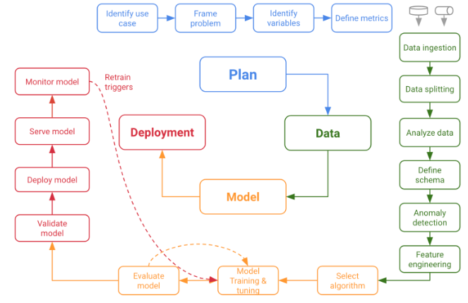

The whole documentation of this project can be also found on Github: [Github Repo: Student Grades](https://github.com/DanielSteck/Project-Students-grades)

# Plan

Before a project can be started the planning needs to be made first. Without the planning for the project the result often is not what was requested at the beginning. Therefore it is necessary to define what shall be made in the project and what are the targets of this project to be considered successful. Moreover, an usecase is needed as the project shall bring a benefit for the company or the results and models can be sold to others.

To sum it up this chapter is basis for the project and defines the usecase, the problem which shall be solved in this project and the targets which shall be achieved in order to determine at the end if the project was successful or not.

Note: The description in this chapter is without sources for the statements as the target was to describe a fitting "plan" chapter for this project. Some statements wont be applicable, but in the following they will be used as an assumption for the project.

## Identify use case

We are a new start-up which is solving issues in companies with the latest data science technology. As we are not know in the market yet, our costumers are a bit skeptical regarding our skills. Due to that we got the job to show our skills within this project. For this our costumer provided this dataset from kaggle:

-   [Predict the performance of students](https://www.kaggle.com/datasets/rkiattisak/student-performance-in-mathematics?resource=download)

This dataset contains 1000 observations of students and their performance on their exams. Moreover, several further information for each student is given.

The target is to predict the performance of students based on demographic criteria and other factors. In addition to that several research questions shall be answered (e.g which impact has the level of education of the parents on their exam score). In order to prove our skills to the costumer the following topics shall be included within that project:

-   SQL queries

-   R queries

-   Data visualization and the impact on the target variable

-   Data Preprocessing

-   Train different types of machine learning models

-   Determine the best model and deploy it

## Frame the problem

In the past it was noticed that the gap between students with very good marks and the one with quite bad ones is getting bigger and bigger, but it is not known yet why this keeps happening. This also leads to a gap when the students finish their education and they are going to work. In the future more and more people are not having the required qualification for their jobs as they are not able to finish their education due to bad marks. This needs to be stopped and changes in the system have to be made in order to improve this and to keep the country ready for the developments in the next decades.

As our costumer is responsible for the education system they are very curious of the results from this project. Based on what can be learned in the queries and visualizations as well as in the models, they plan to make changes in their education system. For example a special assistance for students who are not performing that good. It depends on the results of this project to identify possible target groups who need more support in order to improve their skills and performance in exams. Therefore, it is important to learn which groups have disadvantages in their education and why. Only with this information it is possible to support them. As more and more students with a good mark are finishing their education the qualification in the labour market will increase and this will improve the economic power of our country.

The model shall support on this task. As it will be possible to play around with the characteristics of the students and their background. The model can be the basis for the decisions for the education system.

Due to the fact that a numeric target variable shall be predicted, this project focuses on the supervised learning and a regression model shall be created.

## Identify variables

The provided dataset contains eight different variables and 1000 observations. Each observation represents one student (data was anonymized) with his/her score in exams and their characteristics and their background.

Variables in the dataset:

-   **Gender:** Gender of the student. This variable has two levels in this dataset. The available data is split either in male or female.

-   **Race/ethnicity:** This columns describe the racial or ethnic background of the students (e.g. Asian, African-American, Hispanic, etc.). Note: This column was transferred in groups without information which group displays which ethnicity. This was done to get the result in this project only on the data itself and to avoid the influence of prejudges and stereotypes.

-   **Parental level of education:** What is the highest level of education attained from the students parents.There is no differentiation between the parents and only the highest level of education is listed here. The level of education from the other parent is ignored.

-   **Lunch:** What type of lunch do the students receive: Either the standard type of lunch or a free/reduced option. The free/reduced option is probably only available for students who have a family which is kind of poor.

-   **Test preparation course:** Did the students complete a test preparation course or not?

-   **Math score:** Score which was achieved by the student in a standardized mathematics test.

-   **Reading score:** Score which was achieved by the student in a standardized reading test.

-   **Writing score:** Score which was achieved by the student in a standardized writing test.

Target of this project is to get a general overview of the students performance. It is not needed to know in which course they are performing good or bad. This is important for the later steps to work with the data, but not for now. Therefore, a more generic variable shall be created which combines the total performance of the students instead of the detailed overview for math, reading and writing.

## Define metrics

This project has several aspects which determine that is was successful. Note not all aspects need to be fulfilled, but there are some targets which should be fulfilled. One of this aspects is that new insights are made based on the available data set and our costumer can use this information as a basis for their decisions. It would be great if these results could be visualized in an interactive dashboard to work with the data.

Regarding the modelling process it is important that the model shall be deployed at the end of the project. Moreover some metrics are defined in order to define if the model is fulfilling the requested performance. As a regression model shall be created the following metrics are suitable in order the check if the model is performing good or not. These metrics are commonly used for evaluating and reporting the performance of regression models.

-   **RMSE/MSE:** Root Mean Squared Error / Mean Squared Error. The MSE is the mean of the squared differences between the predicted and the actual target values in the dataset. This means the result displays the squared units. This often leads to confusion (e.g. if the result is in squared dollars). The RMSE is the root of this value and is therefore often used when reporting results. Target for this project is to have a RMSE value which is smaller than 10.

-   **R squared:** Measure how much variability in dependent variable can be explained by the model. This metric is the square of Correlation Coefficient (R). The values of this metrics are between 0 and 1. The higher this metric is indicates a better fit between prediction and the actual variable. For this project the R squared value shall be at 0.4, as we only have categorical variables in the dataset.

-   **MAE:** Mean absolute error is the average of the absolute errors. Unlike the RMSE the changes in the MAE are linear and therefore intuitive. The created model at the end shall have a MAE of less than ten percent of the mean of the target value. After the data analysis was made it can be said that this would be less than 6.9.

Beside these metrics the model has to be for sure better than a model which only predicts the average of the target variable.

Sources: [Machine Learning Mastery: Regression Metrics](https://machinelearningmastery.com/regression-metrics-for-machine-learning/), [Towards Data Science: 3 best metrics to evaluate Regression Model?](https://towardsdatascience.com/what-are-the-best-metrics-to-evaluate-your-regression-model-418ca481755b)

# Data

Within this chapter the data will be ingested and analyzed. Furthermore the data is also added into a SQL database and will be used for making queries.

## SQL data analysis

Before the steps of the data science lifecycle are made, some SQL queries will be made on the data, in order to answer questions from our costumers.

First the DBI library is loaded and afterwards the data is added into the database.


::: {.cell}

```{.r .cell-code}
knitr::opts_chunk$set(warning = FALSE, message = FALSE, collapse = TRUE) 
library (DBI)
library(tidyverse)
```

::: {.cell-output .cell-output-stderr}
```
Warning: Paket 'tidyverse' wurde unter R Version 4.2.3 erstellt
```
:::

::: {.cell-output .cell-output-stderr}
```
Warning: Paket 'ggplot2' wurde unter R Version 4.2.3 erstellt
```
:::

::: {.cell-output .cell-output-stderr}
```
Warning: Paket 'tibble' wurde unter R Version 4.2.3 erstellt
```
:::

::: {.cell-output .cell-output-stderr}
```
Warning: Paket 'dplyr' wurde unter R Version 4.2.3 erstellt
```
:::

::: {.cell-output .cell-output-stderr}
```
── Attaching core tidyverse packages ──────────────────────── tidyverse 2.0.0 ──
✔ dplyr     1.1.1     ✔ readr     2.1.4
✔ forcats   1.0.0     ✔ stringr   1.5.0
✔ ggplot2   3.4.2     ✔ tibble    3.2.1
✔ lubridate 1.9.2     ✔ tidyr     1.3.0
✔ purrr     1.0.1     
── Conflicts ────────────────────────────────────────── tidyverse_conflicts() ──
✖ dplyr::filter() masks stats::filter()
✖ dplyr::lag()    masks stats::lag()
ℹ Use the conflicted package (<http://conflicted.r-lib.org/>) to force all conflicts to become errors
```
:::
:::

::: {.cell}

```{.r .cell-code}

# Connection to database 
con <- dbConnect(RSQLite::SQLite(), ":memory:")

path_sql <- "https://raw.githubusercontent.com/DanielSteck/Project-Students-grades/main/exams.csv"

# Write data into database
dbWriteTable(con, "exams_sql", read_csv(path_sql, show_col_types = FALSE))

#show table in database

dbListTables(con)
## [1] "exams_sql"
```
:::


### First look on the data


::: {.cell}

```{.sql .cell-code}

SELECT *
FROM exams_sql;

```


<div class="knitsql-table">


Table: Displaying records 1 - 10

|gender |race/ethnicity |parental level of education |lunch        |test preparation course | math score| reading score| writing score|
|:------|:--------------|:---------------------------|:------------|:-----------------------|----------:|-------------:|-------------:|
|female |group D        |some college                |standard     |completed               |         59|            70|            78|
|male   |group D        |associate's degree          |standard     |none                    |         96|            93|            87|
|female |group D        |some college                |free/reduced |none                    |         57|            76|            77|
|male   |group B        |some college                |free/reduced |none                    |         70|            70|            63|
|female |group D        |associate's degree          |standard     |none                    |         83|            85|            86|
|male   |group C        |some high school            |standard     |none                    |         68|            57|            54|
|female |group E        |associate's degree          |standard     |none                    |         82|            83|            80|
|female |group B        |some high school            |standard     |none                    |         46|            61|            58|
|male   |group C        |some high school            |standard     |none                    |         80|            75|            73|
|female |group C        |bachelor's degree           |standard     |completed               |         57|            69|            77|

</div>
:::


The dataset contains 1000 observation with eight variables. Three out of these 8 variables are the students performance on different exams.

Show the first 10 observations:


::: {.cell}

```{.sql .cell-code}

SELECT *
FROM exams_sql
LIMIT 10;
```


<div class="knitsql-table">


Table: Displaying records 1 - 10

|gender |race/ethnicity |parental level of education |lunch        |test preparation course | math score| reading score| writing score|
|:------|:--------------|:---------------------------|:------------|:-----------------------|----------:|-------------:|-------------:|
|female |group D        |some college                |standard     |completed               |         59|            70|            78|
|male   |group D        |associate's degree          |standard     |none                    |         96|            93|            87|
|female |group D        |some college                |free/reduced |none                    |         57|            76|            77|
|male   |group B        |some college                |free/reduced |none                    |         70|            70|            63|
|female |group D        |associate's degree          |standard     |none                    |         83|            85|            86|
|male   |group C        |some high school            |standard     |none                    |         68|            57|            54|
|female |group E        |associate's degree          |standard     |none                    |         82|            83|            80|
|female |group B        |some high school            |standard     |none                    |         46|            61|            58|
|male   |group C        |some high school            |standard     |none                    |         80|            75|            73|
|female |group C        |bachelor's degree           |standard     |completed               |         57|            69|            77|

</div>
:::


It can be seen that the columns should be renamed as there are e.g. spaces included:


::: {.cell}

```{.sql .cell-code}

ALTER TABLE exams_sql
RENAME COLUMN "race/ethnicity" TO ethnicity

```
:::

::: {.cell}

```{.sql .cell-code}
ALTER TABLE exams_sql
RENAME COLUMN "parental level of education" TO parent_education

```
:::

::: {.cell}

```{.sql .cell-code}
ALTER TABLE exams_sql
RENAME COLUMN "test preparation course" TO prep_course
```
:::

::: {.cell}

```{.sql .cell-code}

ALTER TABLE exams_sql
RENAME COLUMN "math score" TO math_score
```
:::

::: {.cell}

```{.sql .cell-code}
ALTER TABLE exams_sql
RENAME COLUMN "reading score" TO reading_score
```
:::

::: {.cell}

```{.sql .cell-code}
ALTER TABLE exams_sql
RENAME COLUMN "writing score" TO writing_score;
```
:::


Check the renamed columns


::: {.cell}

```{.sql .cell-code}
SELECT *
FROM exams_sql
```


<div class="knitsql-table">


Table: Displaying records 1 - 10

|gender |ethnicity |parent_education   |lunch        |prep_course | math_score| reading_score| writing_score|
|:------|:---------|:------------------|:------------|:-----------|----------:|-------------:|-------------:|
|female |group D   |some college       |standard     |completed   |         59|            70|            78|
|male   |group D   |associate's degree |standard     |none        |         96|            93|            87|
|female |group D   |some college       |free/reduced |none        |         57|            76|            77|
|male   |group B   |some college       |free/reduced |none        |         70|            70|            63|
|female |group D   |associate's degree |standard     |none        |         83|            85|            86|
|male   |group C   |some high school   |standard     |none        |         68|            57|            54|
|female |group E   |associate's degree |standard     |none        |         82|            83|            80|
|female |group B   |some high school   |standard     |none        |         46|            61|            58|
|male   |group C   |some high school   |standard     |none        |         80|            75|            73|
|female |group C   |bachelor's degree  |standard     |completed   |         57|            69|            77|

</div>
:::


Lets have a look on the gender and their performance in math.


::: {.cell}

```{.sql .cell-code}

SELECT gender, "math_score"
FROM exams_sql;
```


<div class="knitsql-table">


Table: Displaying records 1 - 10

|gender | math_score|
|:------|----------:|
|female |         59|
|male   |         96|
|female |         57|
|male   |         70|
|female |         83|
|male   |         68|
|female |         82|
|female |         46|
|male   |         80|
|female |         57|

</div>
:::


### Data Exploration

How many different genders are in the dataset?


::: {.cell}

```{.sql .cell-code}

SELECT DISTINCT gender
FROM exams_sql;

```


<div class="knitsql-table">


Table: 2 records

|gender |
|:------|
|female |
|male   |

</div>
:::


How many different ethnicities are in the dataset?


::: {.cell}

```{.sql .cell-code}

SELECT DISTINCT ethnicity
FROM exams_sql;
```


<div class="knitsql-table">


Table: 5 records

|ethnicity |
|:---------|
|group D   |
|group B   |
|group C   |
|group E   |
|group A   |

</div>
:::


How many different forms of parent_education are in the dataset?


::: {.cell}

```{.sql .cell-code}

SELECT DISTINCT parent_education
FROM exams_sql;
```


<div class="knitsql-table">


Table: 6 records

|parent_education   |
|:------------------|
|some college       |
|associate's degree |
|some high school   |
|bachelor's degree  |
|master's degree    |
|high school        |

</div>
:::


How many different lunch types are in the dataset?


::: {.cell}

```{.sql .cell-code}

SELECT DISTINCT lunch
FROM exams_sql;
```


<div class="knitsql-table">


Table: 2 records

|lunch        |
|:------------|
|standard     |
|free/reduced |

</div>
:::


How many different types of preparation courses are in the dataset?


::: {.cell}

```{.sql .cell-code}

SELECT DISTINCT prep_course
FROM exams_sql;

```


<div class="knitsql-table">


Table: 2 records

|prep_course |
|:-----------|
|completed   |
|none        |

</div>
:::


How many observations are in the data set?


::: {.cell}

```{.sql .cell-code}

SELECT 
  COUNT(*) as rows
FROM exams_sql;
```


<div class="knitsql-table">


Table: 1 records

| rows|
|----:|
| 1000|

</div>
:::


How many observations are available for each parent_education


::: {.cell}

```{.sql .cell-code}

SELECT parent_education,
  COUNT(parent_education) AS amount_of_observations
FROM exams_sql
GROUP BY parent_education
ORDER BY amount_of_observations DESC;
```


<div class="knitsql-table">


Table: 6 records

|parent_education   | amount_of_observations|
|:------------------|----------------------:|
|some college       |                    224|
|high school        |                    215|
|associate's degree |                    204|
|some high school   |                    177|
|bachelor's degree  |                    105|
|master's degree    |                     75|

</div>
:::


How many students have a math score above 80?


::: {.cell}

```{.sql .cell-code}

SELECT 
  COUNT(*) as students_above_math_80
FROM exams_sql
WHERE math_score > 80;
```


<div class="knitsql-table">


Table: 1 records

| students_above_math_80|
|----------------------:|
|                    227|

</div>
:::


Have a look at the observations of students with more than 90 in reading score


::: {.cell}

```{.sql .cell-code}

SELECT *
FROM exams_sql
WHERE reading_score >90;

```


<div class="knitsql-table">


Table: Displaying records 1 - 10

|gender |ethnicity |parent_education   |lunch        |prep_course | math_score| reading_score| writing_score|
|:------|:---------|:------------------|:------------|:-----------|----------:|-------------:|-------------:|
|male   |group D   |associate's degree |standard     |none        |         96|            93|            87|
|female |group C   |high school        |standard     |none        |         87|            92|            81|
|male   |group D   |some high school   |standard     |none        |         90|            93|            84|
|female |group E   |some high school   |standard     |completed   |         89|            93|            93|
|female |group B   |some high school   |free/reduced |completed   |         73|            91|            88|
|male   |group B   |associate's degree |free/reduced |completed   |         84|            91|            89|
|male   |group D   |master's degree    |free/reduced |completed   |         91|            93|            95|
|male   |group D   |master's degree    |standard     |none        |        100|            97|            91|
|female |group C   |associate's degree |standard     |completed   |         91|            96|            97|
|female |group E   |bachelor's degree  |standard     |none        |         98|            95|           100|

</div>
:::


Check the observations of all females with more than 90 in writing score. The result shall be ordered by writing score (decreasing)


::: {.cell}

```{.sql .cell-code}

SELECT*
FROM exams_sql
WHERE gender ="female" AND writing_score>90
ORDER BY writing_score DESC;

```


<div class="knitsql-table">


Table: Displaying records 1 - 10

|gender |ethnicity |parent_education   |lunch        |prep_course | math_score| reading_score| writing_score|
|:------|:---------|:------------------|:------------|:-----------|----------:|-------------:|-------------:|
|female |group E   |bachelor's degree  |standard     |none        |         98|            95|           100|
|female |group B   |associate's degree |standard     |completed   |         91|            99|           100|
|female |group E   |associate's degree |standard     |none        |         96|            93|           100|
|female |group D   |high school        |standard     |completed   |         91|           100|           100|
|female |group D   |associate's degree |standard     |completed   |         82|            95|           100|
|female |group E   |some college       |standard     |completed   |         96|            98|           100|
|female |group D   |bachelor's degree  |standard     |completed   |         83|           100|           100|
|female |group B   |some college       |standard     |completed   |         92|           100|           100|
|female |group D   |master's degree    |standard     |completed   |         87|            95|           100|
|female |group C   |associate's degree |free/reduced |completed   |         89|            98|            99|

</div>
:::


Check all observations of students with more than 90% in one of the exams and made NO prep_course


::: {.cell}

```{.sql .cell-code}
SELECT *
FROM exams_sql
WHERE prep_course = "none" AND (math_score>90 OR writing_score>90 OR reading_score>90);

```


<div class="knitsql-table">


Table: Displaying records 1 - 10

|gender |ethnicity |parent_education   |lunch        |prep_course | math_score| reading_score| writing_score|
|:------|:---------|:------------------|:------------|:-----------|----------:|-------------:|-------------:|
|male   |group D   |associate's degree |standard     |none        |         96|            93|            87|
|female |group C   |high school        |standard     |none        |         87|            92|            81|
|male   |group D   |some high school   |standard     |none        |         90|            93|            84|
|male   |group D   |master's degree    |standard     |none        |        100|            97|            91|
|male   |group E   |some college       |standard     |none        |         98|            79|            85|
|female |group E   |bachelor's degree  |standard     |none        |         98|            95|           100|
|female |group E   |high school        |standard     |none        |         90|            96|            88|
|female |group B   |bachelor's degree  |standard     |none        |         84|            91|            93|
|male   |group C   |bachelor's degree  |standard     |none        |         91|            83|            82|
|female |group D   |master's degree    |free/reduced |none        |         93|            98|            94|

</div>
:::


What are the average exam scores of the different ethnicies?


::: {.cell}

```{.sql .cell-code}
SELECT ethnicity,
  AVG(math_score) as avg_math,
  AVG(reading_score) as avg_read,
  AVG(writing_score) as avg_write
FROM exams_sql
GROUP BY ethnicity;
```


<div class="knitsql-table">


Table: 5 records

|ethnicity | avg_math| avg_read| avg_write|
|:---------|--------:|--------:|---------:|
|group A   | 65.69620| 69.20253|  67.84810|
|group B   | 64.07071| 68.53030|  66.71717|
|group C   | 65.51084| 68.60991|  66.80495|
|group D   | 68.87938| 70.92996|  71.05837|
|group E   | 77.42657| 76.61538|  75.03496|

</div>
:::


What are the best exam scores?


::: {.cell}

```{.sql .cell-code}

SELECT 
  MAX(math_score) as max_math,
  MAX(reading_score) as max_read,
  MAX(writing_score) as max_write
FROM exams_sql;
```


<div class="knitsql-table">


Table: 1 records

| max_math| max_read| max_write|
|--------:|--------:|---------:|
|      100|      100|       100|

</div>
:::


What are the worst exam scores?


::: {.cell}

```{.sql .cell-code}

SELECT 
  MIN(math_score) as min_math,
  MIN(reading_score) as min_read,
  MIN(writing_score) as min_write
FROM exams_sql;
```


<div class="knitsql-table">


Table: 1 records

| min_math| min_read| min_write|
|--------:|--------:|---------:|
|       15|       25|        15|

</div>
:::


What are the average exam scores for the genders?


::: {.cell}

```{.sql .cell-code}

SELECT gender,
  (AVG(math_score) + AVG(reading_score) + AVG(writing_score)) /3 as avg_exams_score
FROM exams_sql
GROUP BY gender;
```


<div class="knitsql-table">


Table: 2 records

|gender | avg_exams_score|
|:------|---------------:|
|female |        70.56233|
|male   |        67.70472|

</div>
:::


Show all observations which are parents_education "high_school" and have an average score in exams between 80 and 90. Result shall be ordered descending by avg_exam_score


::: {.cell}

```{.sql .cell-code}

SELECT gender, ethnicity, parent_education, lunch, prep_course,
  (math_score + reading_score + writing_score) /3 as avg_exams_score
FROM exams_sql
WHERE parent_education = "high school" AND avg_exams_score BETWEEN 80 AND 90;
```


<div class="knitsql-table">


Table: Displaying records 1 - 10

|gender |ethnicity |parent_education |lunch        |prep_course | avg_exams_score|
|:------|:---------|:----------------|:------------|:-----------|---------------:|
|female |group C   |high school      |standard     |none        |        86.66667|
|male   |group D   |high school      |standard     |completed   |        82.00000|
|male   |group B   |high school      |standard     |none        |        80.00000|
|female |group B   |high school      |free/reduced |completed   |        86.66667|
|female |group C   |high school      |free/reduced |none        |        83.33333|
|male   |group C   |high school      |standard     |none        |        80.33333|
|female |group C   |high school      |standard     |none        |        81.00000|
|female |group D   |high school      |standard     |none        |        83.00000|
|male   |group A   |high school      |standard     |completed   |        83.66667|
|male   |group D   |high school      |standard     |completed   |        81.00000|

</div>
:::


Show all male ethnicities which have an average_exam score less than 70. Order the avg_exams_score ascending.


::: {.cell}

```{.sql .cell-code}

SELECT ethnicity,
  (AVG(math_score) + AVG(reading_score) + AVG(writing_score)) /3 as avg_exams_score
FROM exams_sql
WHERE gender="male"
GROUP BY ethnicity
HAVING avg_exams_score < 70
ORDER BY avg_exams_score;
  

```


<div class="knitsql-table">


Table: 3 records

|ethnicity | avg_exams_score|
|:---------|---------------:|
|group B   |        63.30233|
|group C   |        65.34690|
|group A   |        66.07895|

</div>
:::


## Data ingestion

After the SQL queries were successfully made the next step is to continue with the steps in R. All following steps will be made within R.

### Data Import

First of all the data will be imported from a github repo. The initial data set can be found on Kaggle: [Kaggle: Student performance prediction](https://www.kaggle.com/datasets/rkiattisak/student-performance-in-mathematics?resource=download)

In order to have the same data the whole time this dataset was downloaded and added to my github repo. in case that the kaggle dataset might be updated.


::: {.cell}

```{.r .cell-code}
knitr::opts_chunk$set(warning = FALSE, message = FALSE, collapse = TRUE)
library(tidyverse)

path <- "https://raw.githubusercontent.com/DanielSteck/Project-Students-grades/main/exams.csv"

exams <- read_csv(path, show_col_types = FALSE)
```
:::


### Clean Data

Lets have a look on the first rows to get an expression of the data.


::: {.cell}

```{.r .cell-code}

exams %>%
  slice(1:5)
## # A tibble: 5 × 8
##   gender `race/ethnicity` parental level of educa…¹ lunch test preparation cou…²
##   <chr>  <chr>            <chr>                     <chr> <chr>                 
## 1 female group D          some college              stan… completed             
## 2 male   group D          associate's degree        stan… none                  
## 3 female group D          some college              free… none                  
## 4 male   group B          some college              free… none                  
## 5 female group D          associate's degree        stan… none                  
## # ℹ abbreviated names: ¹​`parental level of education`,
## #   ²​`test preparation course`
## # ℹ 3 more variables: `math score` <dbl>, `reading score` <dbl>,
## #   `writing score` <dbl>
```
:::


Before further steps can be made, the columns names need to be corrected, as they are including spaces and special characters. To remove those, the janitor package will be used.


::: {.cell}

```{.r .cell-code}
library(janitor)
exams <- exams %>%
  clean_names()
```
:::


Beside the cleaning of the names, some variables shall be renamed in order to shorten the length.


::: {.cell}

```{.r .cell-code}
exams <- rename(exams, ethnic_group = race_ethnicity)
exams <- rename(exams, parent_education = parental_level_of_education)
exams <- rename(exams, test_prep = test_preparation_course)
```
:::


The available data consist of 1000 rows. The available features are gender, ethnic_group, parent_education, lunch, test_prep, math_score, reading_score, writing_score.

### Missing data

Lets have a look on the description of the data to check the formats.


::: {.cell}

```{.r .cell-code}
glimpse (exams)
## Rows: 1,000
## Columns: 8
## $ gender           <chr> "female", "male", "female", "male", "female", "male",…
## $ ethnic_group     <chr> "group D", "group D", "group D", "group B", "group D"…
## $ parent_education <chr> "some college", "associate's degree", "some college",…
## $ lunch            <chr> "standard", "standard", "free/reduced", "free/reduced…
## $ test_prep        <chr> "completed", "none", "none", "none", "none", "none", …
## $ math_score       <dbl> 59, 96, 57, 70, 83, 68, 82, 46, 80, 57, 74, 53, 76, 7…
## $ reading_score    <dbl> 70, 93, 76, 70, 85, 57, 83, 61, 75, 69, 69, 50, 74, 7…
## $ writing_score    <dbl> 78, 87, 77, 63, 86, 54, 80, 58, 73, 77, 69, 49, 76, 7…
```
:::


Is there any missing data? lets check it:


::: {.cell}

```{.r .cell-code}
library(visdat)
vis_dat(exams)
```

::: {.cell-output-display}
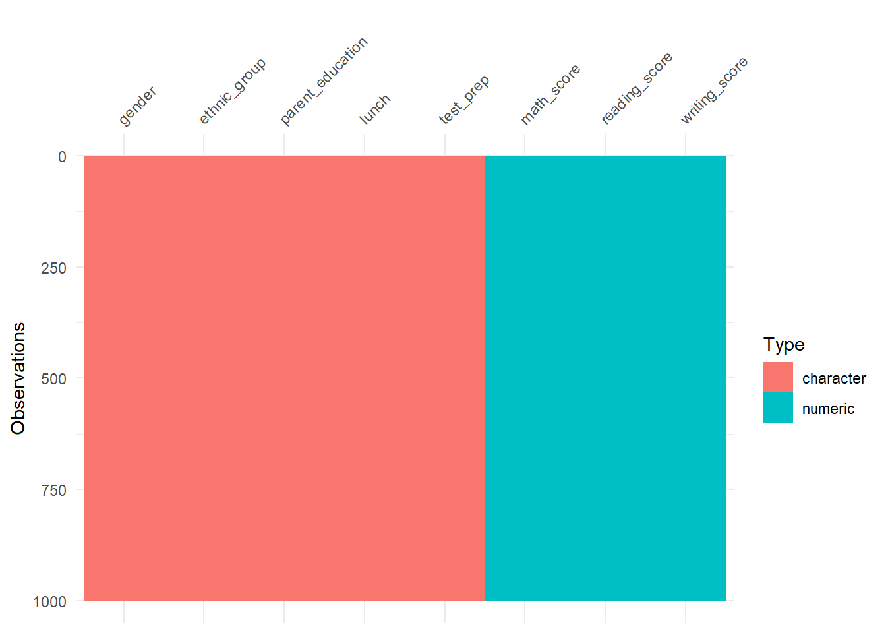{width=672}
:::
:::


Alternative method for missing data:


::: {.cell}

```{.r .cell-code}
is.na(exams) %>% colSums()
##           gender     ethnic_group parent_education            lunch 
##                0                0                0                0 
##        test_prep       math_score    reading_score    writing_score 
##                0                0                0                0
```
:::


There are no missing numbers in the dataset. Three variables (scores in the exam) are numeric, the other variables are characters.

### Format data

Lets have a look on the character columns and check if they should be formatted as factor.


::: {.cell}

```{.r .cell-code}
exams %>%
  count(gender,
        sort = TRUE)
## # A tibble: 2 × 2
##   gender     n
##   <chr>  <int>
## 1 male     508
## 2 female   492
```
:::

::: {.cell}

```{.r .cell-code}
exams %>%
  count(ethnic_group,
        sort = TRUE)
## # A tibble: 5 × 2
##   ethnic_group     n
##   <chr>        <int>
## 1 group C        323
## 2 group D        257
## 3 group B        198
## 4 group E        143
## 5 group A         79
```
:::

::: {.cell}

```{.r .cell-code}
exams %>%
  count(parent_education,
        sort = TRUE)
## # A tibble: 6 × 2
##   parent_education       n
##   <chr>              <int>
## 1 some college         224
## 2 high school          215
## 3 associate's degree   204
## 4 some high school     177
## 5 bachelor's degree    105
## 6 master's degree       75
```
:::

::: {.cell}

```{.r .cell-code}
exams %>%
  count(lunch,
        sort = TRUE)
## # A tibble: 2 × 2
##   lunch            n
##   <chr>        <int>
## 1 standard       660
## 2 free/reduced   340
```
:::

::: {.cell}

```{.r .cell-code}
exams %>%
  count(test_prep,
        sort = TRUE)
## # A tibble: 2 × 2
##   test_prep     n
##   <chr>     <int>
## 1 none        656
## 2 completed   344
```
:::


All character variables are having only a small amount of different levels. Therefore all character variables shall be transferred as factor.


::: {.cell}

```{.r .cell-code}
exams <- 
  exams %>% 
  mutate(across(where(is.character), as.factor))
```
:::


### Create new variables

Target of this project is to predict the students performance on exams. Therefore an additional column shall be added. This column shall include the average exam score of the students.


::: {.cell}

```{.r .cell-code}
exams <- exams%>%
  mutate (avg_score = (math_score + reading_score + writing_score)/3)
```
:::


As all other variables are not numeric, no further new variables can be created.

### Data overview

After successfully cleaning, formatting and checking the data, lets have an overview of the data with the package *skimr*:


::: {.cell}

```{.r .cell-code}
library(skimr)
skim(exams)
```

::: {.cell-output-display}
Table: Data summary

|                         |      |
|:------------------------|:-----|
|Name                     |exams |
|Number of rows           |1000  |
|Number of columns        |9     |
|_______________________  |      |
|Column type frequency:   |      |
|factor                   |5     |
|numeric                  |4     |
|________________________ |      |
|Group variables          |None  |


**Variable type: factor**

|skim_variable    | n_missing| complete_rate|ordered | n_unique|top_counts                             |
|:----------------|---------:|-------------:|:-------|--------:|:--------------------------------------|
|gender           |         0|             1|FALSE   |        2|mal: 508, fem: 492                     |
|ethnic_group     |         0|             1|FALSE   |        5|gro: 323, gro: 257, gro: 198, gro: 143 |
|parent_education |         0|             1|FALSE   |        6|som: 224, hig: 215, ass: 204, som: 177 |
|lunch            |         0|             1|FALSE   |        2|sta: 660, fre: 340                     |
|test_prep        |         0|             1|FALSE   |        2|non: 656, com: 344                     |


**Variable type: numeric**

|skim_variable | n_missing| complete_rate|  mean|    sd| p0|   p25|   p50|   p75| p100|hist  |
|:-------------|---------:|-------------:|-----:|-----:|--:|-----:|-----:|-----:|----:|:-----|
|math_score    |         0|             1| 67.81| 15.25| 15| 58.00| 68.00| 79.25|  100|▁▂▇▇▃ |
|reading_score |         0|             1| 70.38| 14.11| 25| 61.00| 70.50| 80.00|  100|▁▃▇▇▃ |
|writing_score |         0|             1| 69.14| 15.03| 15| 59.00| 70.00| 80.00|  100|▁▂▆▇▃ |
|avg_score     |         0|             1| 69.11| 14.03| 20| 59.58| 69.67| 79.33|  100|▁▂▇▇▃ |
:::
:::


The available data set consists of 1000 rows with in total 9 columns. Four columns are numeric while five are a factor.

Three factor variables have only two levels, while the other two have five and six levels. The distribution of the gender column in the two genders is quite balanced. The columns lunch and test_prep are split in 2:1 in their variables.

The distribution of the numeric variables is very similar. in general the math_score has the lowest values compared to the other three scores, but the difference is not that big. The statistics for p25, p50, p75, p100 as well as the histograms are looking very similar and the differences are only minor. The reading score has the best results in the exam.

### Define features and outcome variable

In advance of the data splitting the definition of the target variable and the feature variables shall be made.

The performance in the exams shall be predicted, for this the average performance is sufficient. As the target is to predict the performance, the variables for math, reading and writing score must not be included into the feature list.

It would be also possible to make a use case for students which predicts e.g. the performance in math and also includes the students performance in the other exams. In this case only the general performance shall be predicted to see which generic attributes have a influence on students performance. Also exams are most time in a thigh schedule, which means that there wont be a lot of time between exams. Therefore it does not make sense to include also the performance in other exams to predict the performance in e.g. math. Moreover it takes some time until the results are available. So probably the students already had their exam before they receive the first results. Therefore the target in this project is the prediction of an average exam performance without including the performance in the other exams.

Nevertheless in the data exploration these other exam scores will be also included, but they wont go into the model.


::: {.cell}

```{.r .cell-code}
y_label <- 'avg_score' #define target
features <- c('gender', 'ethnic_group', 'parent_education', 'lunch', 'test_prep') #define features
X <- exams %>%
  select(all_of(features))
y <- exams %>%
  select(all_of(y_label))
```
:::


Our data is now prepared for the data splitting and for building the pipelines.

## Data splitting

Before the data exploration can be started, the data shall be split into a training and test set. No insights from the test data shall be used as data insights. Test data was not seen before therefore no information given by test data can be used.

To ensure that the training and test set is representative of the various categories of `avg_score` in the whole dataset, lets have a look on the histogram


::: {.cell}

```{.r .cell-code}
exams %>%
  ggplot(aes(avg_score)) + 
  geom_histogram (bins=6) #tested several, 6 makes most sense 
```

::: {.cell-output-display}
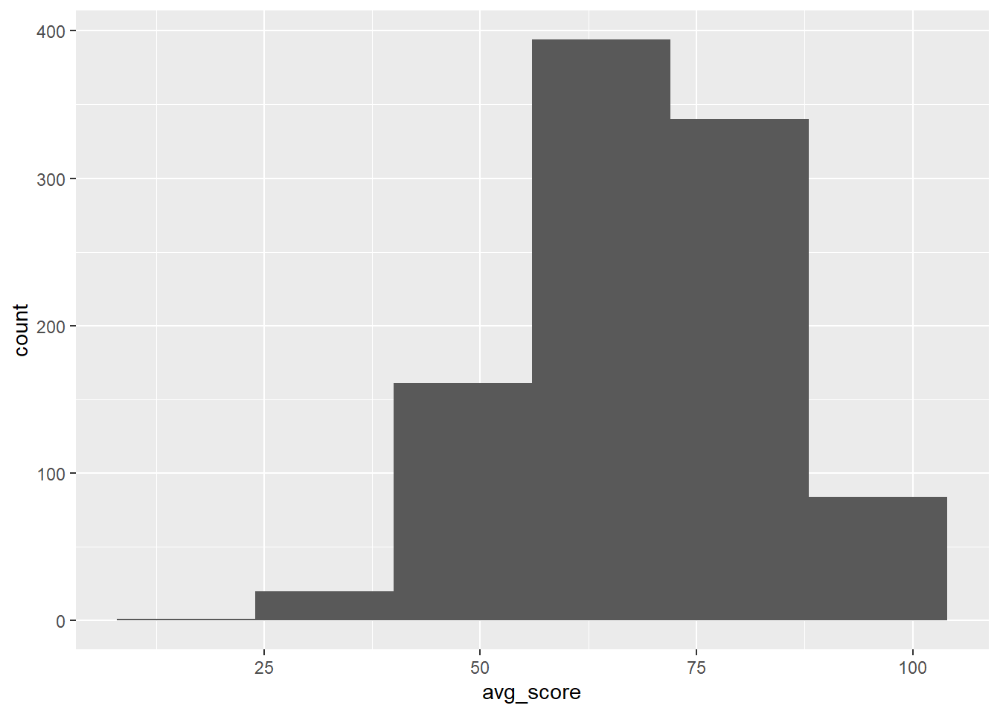{width=672}
:::
:::


The split data shall included equally data from each of the bins. In order the have the same results for each run, a fix seed is set.

Target is to have 80% of the data for training and 20% for testing.


::: {.cell}

```{.r .cell-code}
library(rsample)

set.seed(50) #for reproducability

# split in train and test data
data_split <- initial_split (exams,
                             prop =4/5,
                             strat = avg_score,
                             breaks = 6)

# Create train dataframe
train_data <- training(data_split)

#create test data set
test_data <- testing(data_split)
```
:::


## Analyze data

This chapter has the target to understand the training data and to see which variables have an influence on the outcome variable **avg_score**.

### Data exploration set

First step is to create a copy of the training data which will be used for the exploratory data analysis.


::: {.cell}

```{.r .cell-code}
df_explo <- train_data
```
:::


### R queries

First of all the data is explored with R queries and afterwards the visualization part is made.

Lets have a look on the statistics of the target variable *avg_score*\*:


::: {.cell}

```{.r .cell-code}
df_explo %>%
  summarise(
    min_score = min(avg_score,na.rm =TRUE) # na dependency not needed as no missing values, but it might be that data changes with an updated dataset
    ,
    mean_score = mean(avg_score,na.rm =TRUE),
    med_score = median(avg_score,na.rm =TRUE),
    std_score = sd(avg_score,na.rm =TRUE),
    iqr_score = IQR(avg_score,na.rm =TRUE),
    q1 =quantile(avg_score, probs =0.25,na.rm =TRUE),
    q3 = quantile(avg_score, probs = 0.75,na.rm =TRUE),
    max_score = max(avg_score,na.rm =TRUE)
    
  )
## # A tibble: 1 × 8
##   min_score mean_score med_score std_score iqr_score    q1    q3 max_score
##       <dbl>      <dbl>     <dbl>     <dbl>     <dbl> <dbl> <dbl>     <dbl>
## 1        20       69.1      69.7      14.1        20  59.3  79.3       100
```
:::


The worst exam result is `20` while `100` is the best one. Moreover the mean and median values are almost similar and there is only a slight difference. This means that there are no big outliers included here (which is also easy to explain as 100 is the best possible performance in an exam). The IQR score of 20 tells us, that the difference between the 75th and 25th percentile is only having a difference of 20. So 50% of the data is within a difference of 20.

25% of the students have an exam score of less than 59,3 and 25% of the students are above 79,3. 50% of the students are between 59,3 and 79,3 (the IQR value can be seen here).

Moreover it is interesting how the median, mean and iqr, q1, q3 values are distributed within the categorical variables.

Lets have a look on the gender variable and sort the results descending.


::: {.cell}

```{.r .cell-code}
df_explo %>%
  group_by(gender) %>%
  summarise(
    mean_score = mean(avg_score,na.rm =TRUE),
    med_score = median(avg_score,na.rm =TRUE),
    iqr_score = IQR(avg_score,na.rm =TRUE),
    q1 =quantile(avg_score, probs =0.25,na.rm =TRUE),
    q3 = quantile(avg_score, probs = 0.75,na.rm =TRUE)) %>% 
      
arrange(desc(med_score))
## # A tibble: 2 × 6
##   gender mean_score med_score iqr_score    q1    q3
##   <fct>       <dbl>     <dbl>     <dbl> <dbl> <dbl>
## 1 female       70.9      71.7      20    61.7  81.7
## 2 male         67.3      67.7      19.8  57.7  77.4
```
:::


The performance of female students is better than the performance of male students. The mean score for females is 3.3 higher and the median score is 4.0 higher.

Lets have a look on the ethic_group variable and sort the results descending.


::: {.cell}

```{.r .cell-code}
df_explo %>%
  group_by(ethnic_group) %>%
  summarise(
    mean_score = mean(avg_score,na.rm =TRUE),
    med_score = median(avg_score,na.rm =TRUE),
    iqr_score = IQR(avg_score,na.rm =TRUE),
    q1 =quantile(avg_score, probs =0.25,na.rm =TRUE),
    q3 = quantile(avg_score, probs = 0.75,na.rm =TRUE),
    ) %>%
arrange(desc(med_score))
## # A tibble: 5 × 6
##   ethnic_group mean_score med_score iqr_score    q1    q3
##   <fct>             <dbl>     <dbl>     <dbl> <dbl> <dbl>
## 1 group E            76.2      79        22    65.3  87.3
## 2 group D            70.3      71        18.7  61    79.7
## 3 group A            66.2      67.3      16.5  57.5  74  
## 4 group B            66.3      67.3      20.7  55.7  76.3
## 5 group C            67.2      67.3      17    59.3  76.3
```
:::


The `group E` has the best performance in the exams. There is a huge gap compared to `group D`. Moreover there is almost no difference in mean and median between the other three groups. It might make sense to combine these groups into one group. But lets analyse this first in a visualization, because the IQR score is spreading a lot between these groups. For example the difference in the q1 is much higher than in the mean and median.

Lets have a look on the variable of parents education and sort the results descending.


::: {.cell}

```{.r .cell-code}
df_explo %>%
  group_by(parent_education) %>%
  summarise(
    mean_score = mean(avg_score,na.rm =TRUE),
    med_score = median(avg_score,na.rm =TRUE),
    iqr_score = IQR(avg_score,na.rm =TRUE),
    q1 =quantile(avg_score, probs =0.25,na.rm =TRUE),
    q3 = quantile(avg_score, probs = 0.75,na.rm =TRUE),
    ) %>%
arrange(desc(med_score))
## # A tibble: 6 × 6
##   parent_education   mean_score med_score iqr_score    q1    q3
##   <fct>                   <dbl>     <dbl>     <dbl> <dbl> <dbl>
## 1 associate's degree       71.7      72        19.2  62.8  82  
## 2 master's degree          71.3      71.8      19.5  62.3  81.8
## 3 some college             69.6      71        20.2  59.1  79.2
## 4 bachelor's degree        72.1      70.5      19.3  61.7  81  
## 5 high school              67.4      66.8      18.9  59.1  78  
## 6 some high school         65.4      65        18.9  55.4  74.3
```
:::


It can be seen that a higher parent education is not directly leading to a better exam score. The best students are within the `associate's degree` which is a lower education than the `master's degree` and `bachelor's degree`.

Based on the given levels, this would be the ascending order of parent_education (based on these links):

-   [Associates, Bachelors and Masters](https://thebestschools.org/degrees/college-degree-levels/#:~:text=A%20doctorate%20is%20the%20highest,research%20requirements%2C%20and%20a%20dissertation.)

-   [High School and College](https://usahello.org/education/children/grade-levels/#gref)

-   [College vs Associates degree](http://www.differencebetween.net/miscellaneous/difference-between-diploma-and-associate-degree/#:~:text=A%20student%20may%20take%20one,stone%20to%20a%20higher%20education.)

List of education level in a ascending order:

1.  Some High School/High School --\> I did not find any results for this in a research. Probably High School might be a bit better than some High school
2.  Some College
3.  Associates degree
4.  Bachelor degree
5.  Masters degree

This order of parental education is not represented in the performance of students performance.

The worst exam results are for the parental education of some High School and High School.

Lets have a look on the lunch variable and sort the results descending.


::: {.cell}

```{.r .cell-code}
df_explo %>%
  group_by(lunch) %>%
  summarise(
    mean_score = mean(avg_score,na.rm =TRUE),
    med_score = median(avg_score,na.rm =TRUE),
    iqr_score = IQR(avg_score,na.rm =TRUE),
    q1 =quantile(avg_score, probs =0.25,na.rm =TRUE),
    q3 = quantile(avg_score, probs = 0.75,na.rm =TRUE),
    ) %>%
arrange(desc(med_score))
## # A tibble: 2 × 6
##   lunch        mean_score med_score iqr_score    q1    q3
##   <fct>             <dbl>     <dbl>     <dbl> <dbl> <dbl>
## 1 standard           72.3      72.7      18.6  63.4  82  
## 2 free/reduced       62.9      63.7      18.8  53.7  72.4
```
:::


There is a huge difference between the students performance which have a standard meal and the ones which have a free/reduced meal. Probably the students who are getting a free/reduced meal are from a porerer family which might have less time to spend with their kids or maybe the kids education is not the highest priority. As the family might have financial issues it could be also possible that the students need to work in order to have enough money for the family. Therefore it might be possible that their study time is needed for working and this might lead to worse results.

Lets have a look on the test preparation variable and sort the results descending.


::: {.cell}

```{.r .cell-code}
df_explo %>%
  group_by(test_prep) %>%
  summarise(
    mean_score = mean(avg_score,na.rm =TRUE),
    med_score = median(avg_score,na.rm =TRUE),
    iqr_score = IQR(avg_score,na.rm =TRUE),
    q1 =quantile(avg_score, probs =0.25,na.rm =TRUE),
    q3 = quantile(avg_score, probs = 0.75,na.rm =TRUE),
    ) %>%
arrange(desc(med_score))
## # A tibble: 2 × 6
##   test_prep mean_score med_score iqr_score    q1    q3
##   <fct>          <dbl>     <dbl>     <dbl> <dbl> <dbl>
## 1 completed       73.8      73.5      18.7  65    83.7
## 2 none            66.7      67.3      19.3  57.3  76.7
```
:::


Students who made a test preparation course have much better results than students who didn't. But the difference is much smaller than in the lunch variable.

### Visualizations

In this chapter plots are created in order to learn from the data and find correlations between the variables.

In order to select the correct visualizations the visualizations are based on [From Data to Viz](https://www.data-to-viz.com)

First of all lets start with the plot of the target variable. How is it distributed in the value range?


::: {.cell}

```{.r .cell-code}
library (ggplot2)
ggplot(data = df_explo, mapping = aes(x = avg_score)) +
  geom_density(fill="lightblue") +
  labs(title = "Students performance in exams", 
       subtitle= "Average performance of math, writing and reading exam",
       x = "Average score",
       y = "Density") +
  theme_minimal()+
  theme (text = element_text(size=8),
         legend.key.size = unit(5, "mm"))
```

::: {.cell-output-display}
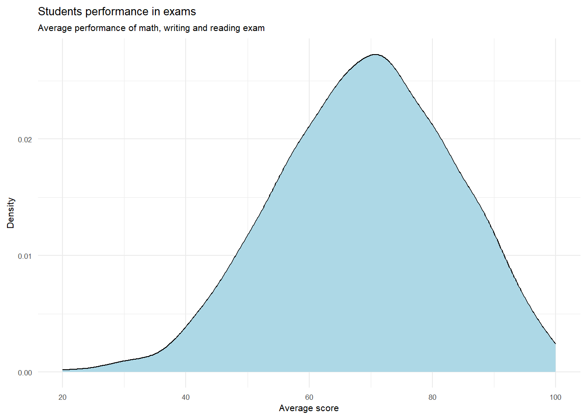{width=672}
:::
:::


The results are quite similar compared to what was learned in the R queries. Highest density of the average_score is at the median score. There are only a small amount of scores which are below 40.

Now lets have a look on our features. For this usecase we only got categorical features in our data set. Therefore lets have a look on their levels and the uniqueness.


::: {.cell}

```{.r .cell-code}
for (i in features){
  
  p <- ggplot(df_explo, aes_string(x=i)) +
  geom_bar(fill="lightblue")+
    labs(title = "Distibution of levels in the varaibles", 
       y= "count") +
  theme_minimal()+
  theme (text = element_text(size=8),
         legend.key.size = unit(5, "mm"))
  
  plot(p)
  }
```

::: {.cell-output-display}
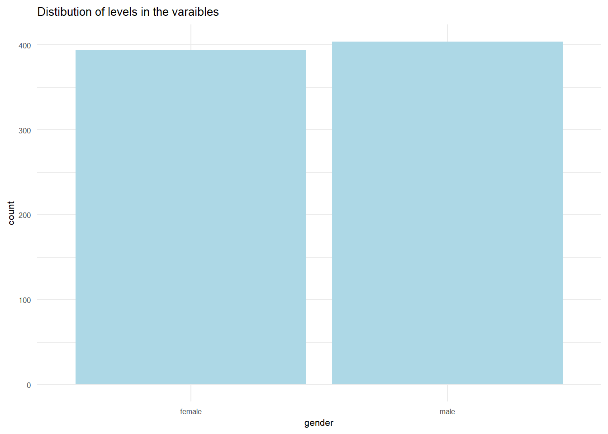{width=672}
:::

::: {.cell-output-display}
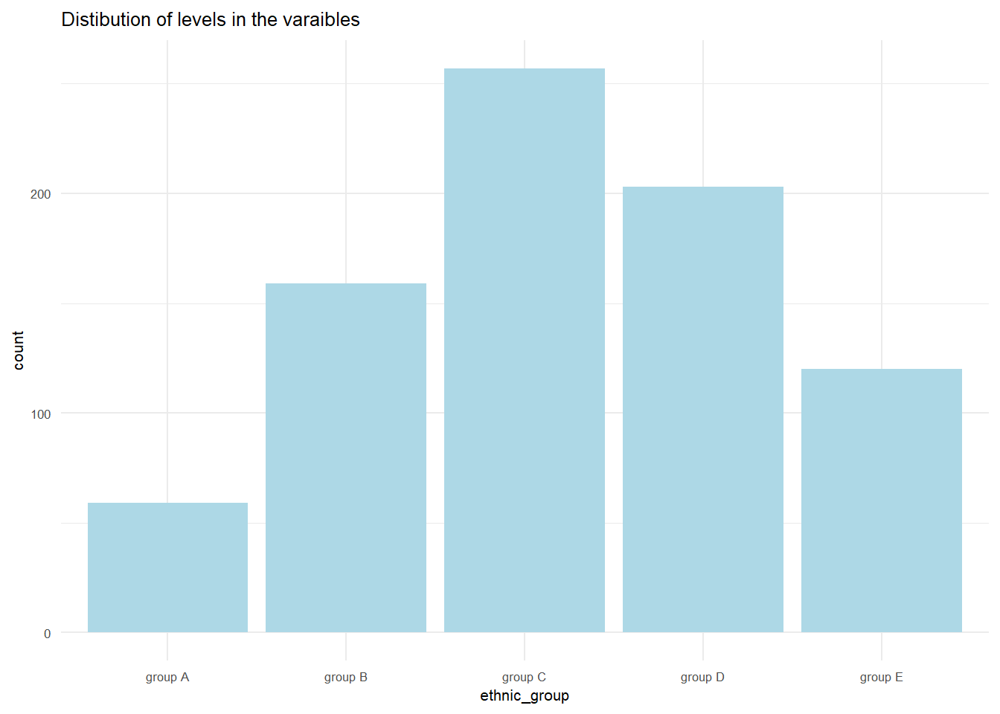{width=672}
:::

::: {.cell-output-display}
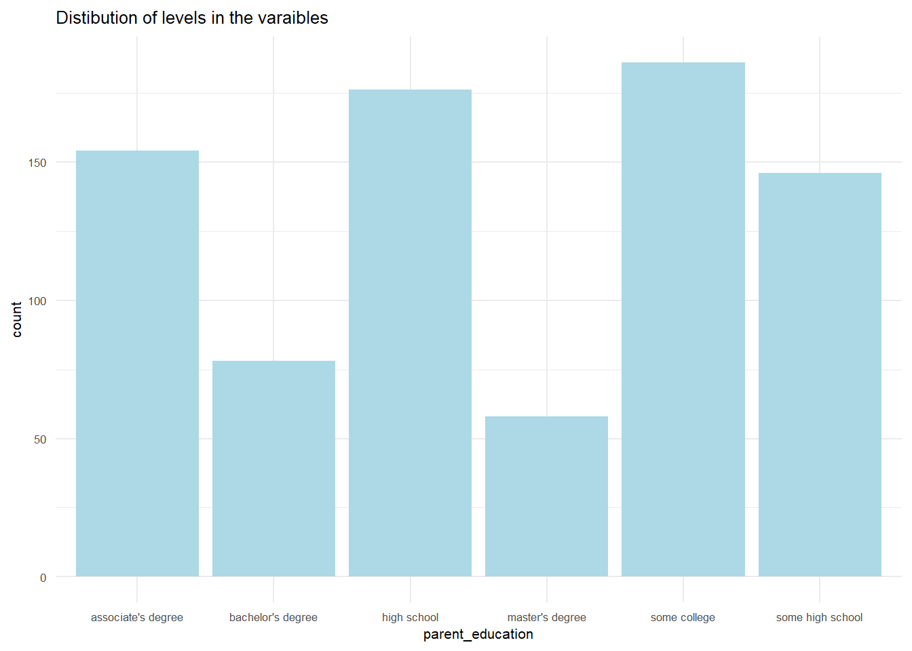{width=672}
:::

::: {.cell-output-display}
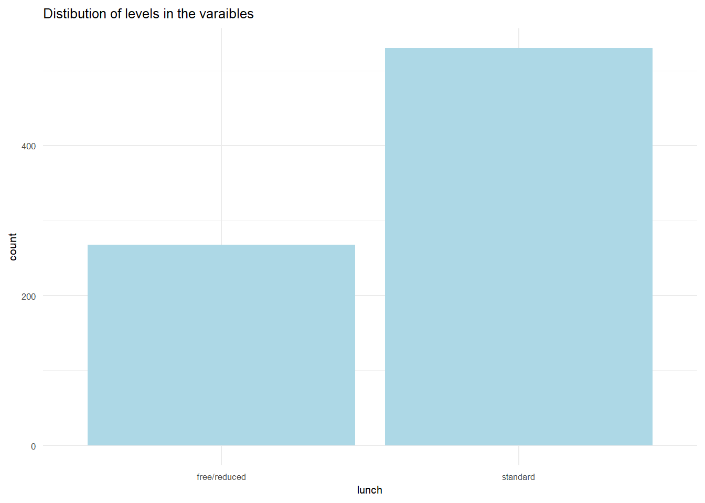{width=672}
:::

::: {.cell-output-display}
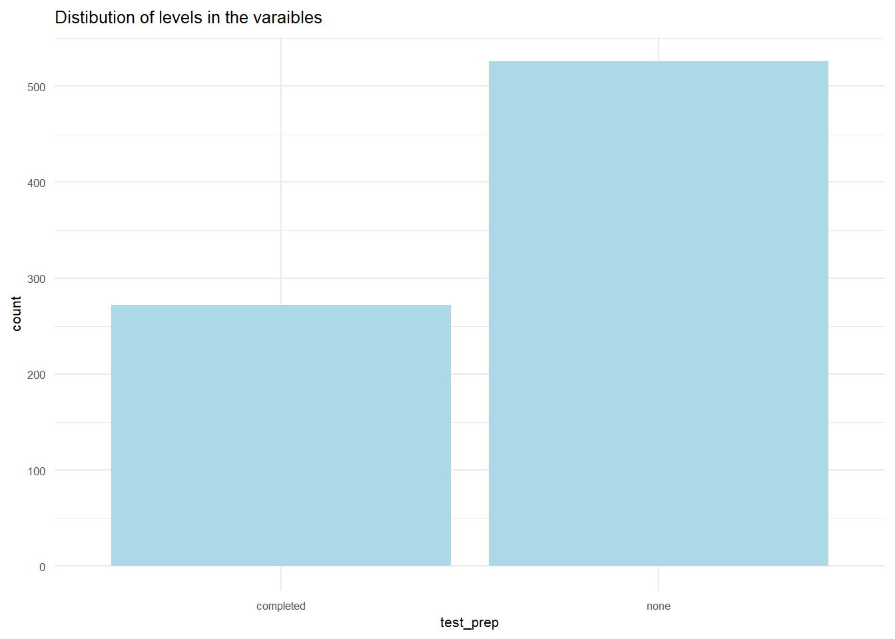{width=672}
:::
:::


It can be seen that there the variable **gender** is equally distributed on male and female.

The **ethnic group** has the most occurrences within group C, while group A and group E have a smaller occurency. Especially group A has only about 50 occurrences.

Regarding the **parents education**- this feature has six levels which are not equally distributed. Four levels have a almost similar occurrence, while the level Bachelors and Masters degree have the lowest occurrences.

The **lunch** type has two levels which are not equally distributed, about 66% occurrences are the standard lunch type, while 33% are the free/reduced type of lunch. This is actually quite a high number of reduced/free lunch meals.

The amount of students who performed a **test preparation** course is about 35% while 65% of students did not make any test preparation.

Lets have a look on the impact of these features and their levels on the target variable **average score**

For this project the visualizations of categorical and the target variable will be made with box plots, density plots, violin plots and histograms in order to show the different possibilities in R. Therefore the variables will be displayed in different graphical visualizations. In general box plots would be a very good way to visualize these results, but for demonstration purposes different visualizations are made.

**Impact Gender on Avg_score**


::: {.cell}

```{.r .cell-code}

ggplot(data = df_explo, mapping = aes(x = avg_score, fill=gender)) +
  geom_histogram(bins=20) +
  labs(title = "Students average performance in exams", 
       subtitle= "By gender",
       x = "Average score in exams",
       y = "count") +
  theme_minimal()+
  theme (text = element_text(size=8),
         legend.key.size = unit(5, "mm"))
```

::: {.cell-output-display}
{width=672}
:::
:::


Actually in this plot it is not that easy to see the differences between those two genders. So therefore lets try it with a facet wrap.


::: {.cell}

```{.r .cell-code}

ggplot(data = df_explo, mapping = aes(x = avg_score, fill=gender)) +
  geom_histogram(bins=20) +
  facet_wrap(~gender, ncol=1)+
  labs(title = "Students average performance in exams", 
       subtitle= "By gender",
       x = "Average score in exams",
       y = "count") +
  theme_minimal()+
  theme (text = element_text(size=8),
         legend.key.size = unit(5, "mm"))
```

::: {.cell-output-display}
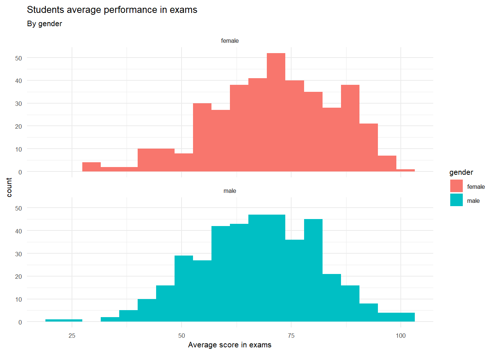{width=672}
:::
:::


Now it can be seen that female are performing better than the males. There are a lot of test results above 80, while the males have a peak at above 75. But it is interesting that the are much more males who achieve 100 points in the exam compared to the women.

**Impact ethnic_group on Avg_score**

The different ethnic groups and their impact on the avg_score shall be displayed within a boxplot.


::: {.cell}

```{.r .cell-code}
library(forcats)
ggplot(df_explo, aes(x = fct_reorder(
  ethnic_group, avg_score, .fun = median, .desc=TRUE), y=avg_score)) +
  geom_boxplot(fill="lightblue") +
  labs(title = "Students average performance in exams", 
       subtitle= "By ethnic group",
       x = "Ethnic group",
       y = "Average score in exams") +
  theme_minimal()+
  theme (text = element_text(size=8),
         legend.key.size = unit(5, "mm"))
```

::: {.cell-output-display}
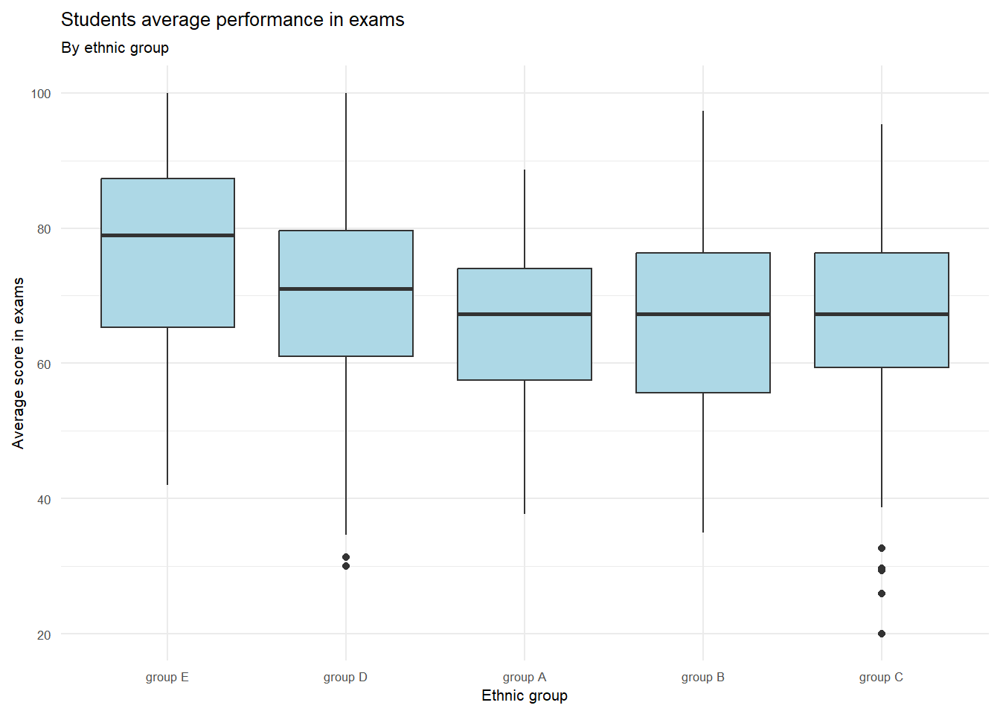{width=672}
:::
:::


Actually the results from the R queries can be confirmed. Best results are in `group E` and the groups `A`, `B` and `C` have almost the same values. Even though there are some outliers in `group C`. The mean for these three groups is almost the same, but it can be seen that `group B` has different whiskers, here the IQR range is spread the most.

**Impact parent_education on Avg_score**

This variable and their influence on the average score shall be visualized in a violin plot.


::: {.cell}

```{.r .cell-code}

ggplot(df_explo, aes(x = fct_reorder(
  parent_education, avg_score, .fun = median, .desc=TRUE), y=avg_score)) +
  geom_violin(fill="lightblue") +
  labs(title = "Students average performance in exams", 
       subtitle= "By parents education",
       x = "Parent Education",
       y = "Average score in exams") +
  theme_minimal()+
  theme (text = element_text(size=8),
         legend.key.size = unit(5, "mm"),
         axis.text.x = element_text(angle = 90))
```

::: {.cell-output-display}
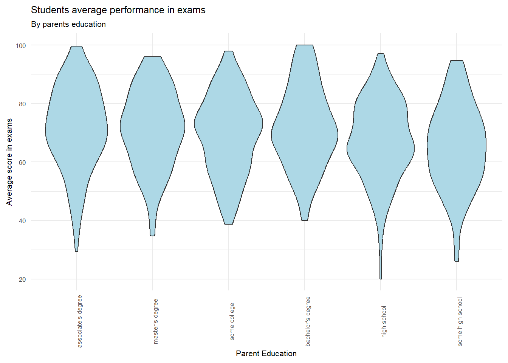{width=672}
:::
:::


Quite similar results as in the R queries. It can be seen that the `associates degree` as parent education leads to the best median score. But it can be seen that there are also a lot of students in this group which have results of less than 40. Only in two other groups the results are worse. In five out of six parent degrees the most students are concentrated nearby the median score. But the `high_school` degree has a peak of at the average score of 63 and as well another, smaller peak at the peak of 80. Moreover on this group there are the students with the worst results. Furthermore the group of `some college` and `bachelors degree` have a very similar violin plot and there are only minor differences between those two groups.

**Impact lunch on Avg_score**

The impact of the lunch type shall be displayed within a density plot. Moreover, this plot shall be extended by the **Impact of test preparation course on Avg_score**.


::: {.cell}

```{.r .cell-code}

ggplot(df_explo, mapping = aes (x=avg_score, fill=lunch)) +
  geom_density(alpha=0.7) + 
  scale_fill_manual("Lunch", values = c("#339999", "#FFFF66"))+
  facet_wrap(~test_prep, ncol=1)+
  labs(title = "Students average performance in exams", 
       subtitle= "By type of lunch and if a test preperation course was made",
       x = "Average score in exams",
       y = "density") +
  theme_minimal()+
  theme (text = element_text(size=8),
         legend.key.size = unit(5, "mm"))
```

::: {.cell-output-display}
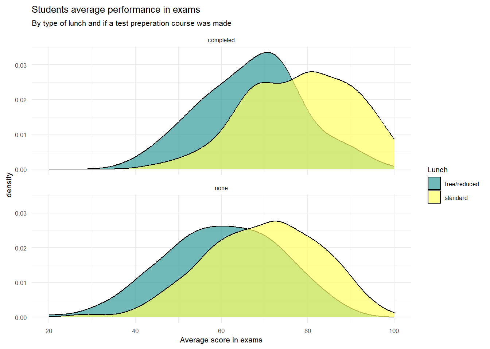{width=672}
:::
:::


It can be clearly seen that the students who completed the test preparation course have a much better performance than those who did not. Also the students who have a standard meal are performing better than those who are having only a free or reduced meal. If both features are combined it can be clearly seen that students who made the test preparation course AND have a standard meal are performing much better than those students who did not make a test preparation course and who only get a free/reduced meal. These two features have a big impact on the target variable.

### Visualizations (incl. perform results)

This chapter is used to show the possibilities of data visualizations if we could use numeric variables. Therefore correlation plots will be made with those variables - even though they must not be included into the later models.

In order to select the correct visualizations the visualizations are based on [From Data to Viz](https://www.data-to-viz.com)

Lets start with the students performance in math compared to their performance in the average exam score.


::: {.cell}

```{.r .cell-code}
ggplot(df_explo, aes(math_score, avg_score))+
  geom_point(color="lightblue")+
  labs(title = "Students average performance in exams", 
       subtitle= "Average performance and math performance",
       x = "Average score in maths",
       y = "Average score in exams") +
  theme_minimal()+
  theme (text = element_text(size=8),
         legend.key.size = unit(5, "mm"))
```

::: {.cell-output-display}
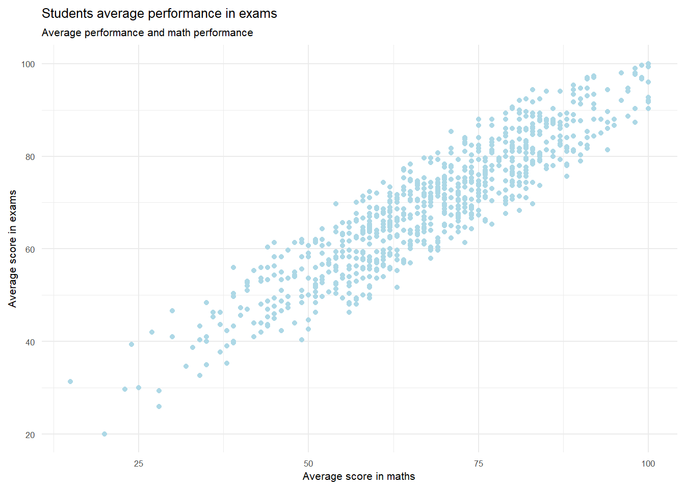{width=672}
:::
:::


It can be clearly seen that there is a linear relationship between the math performance and the average performance (which makes sense as the average performance is based on the math performance, but this is made for demonstration purposes). The correlation between those variables is very strong.

Lets add two further variables to this plot. Lets add the type of lunch and the test preparation as well. Moreover it shall be wrapped by the ethnic group.


::: {.cell}

```{.r .cell-code}
ggplot(df_explo, aes(math_score, avg_score, color=lunch, shape=test_prep))+
  geom_point()+
  facet_wrap(~ethnic_group)+
  labs(title = "Students average performance in exams", 
       subtitle= "By lunch type, ethnic_group and if test preparation was made",
       x = "Average score in maths",
       y = "Average score in exams") +
  theme_minimal()+
  theme (text = element_text(size=8),
         legend.key.size = unit(5, "mm"))
```

::: {.cell-output-display}
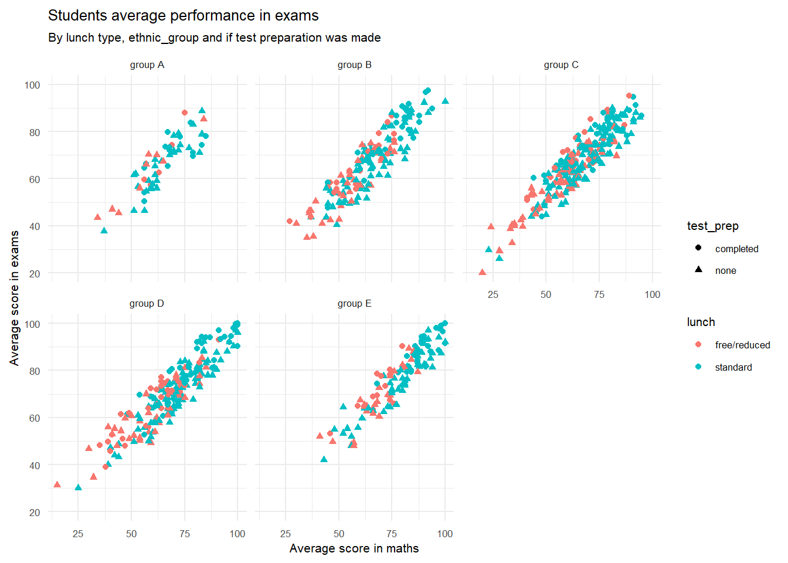{width=672}
:::
:::


It can be seen that the performance in group E and D is the best, as well as that students with standard lunch and test preparation course are performing better.

Now lets have a look on the correlations between our three exam scores and the average exam score.


::: {.cell}

```{.r .cell-code}
df_explo %>% 
  select(where(is.numeric)) %>% # only select numerical data
  vis_cor(cor_method = "spearman", na_action = "pairwise.complete.obs")
```

::: {.cell-output-display}
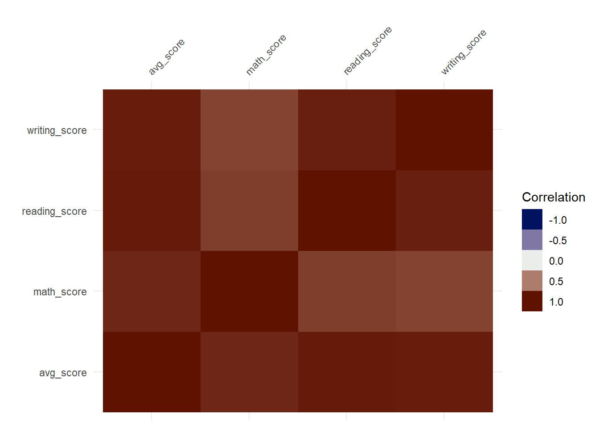{width=672}
:::
:::


It can be seen that all variables have a huge correlation with each other. Students which are performing good in one exam are likely to perform good in all exams. But it can be also seen that the correlation between writing and reading is much higher than the correlation to math and the other exams.

Lets have a look on the numbers:


::: {.cell}

```{.r .cell-code}
library(corrr)

cor_res <- 
  df_explo %>%
  select(where(is.numeric)) %>% 
  correlate(method = "spearman", use = "pairwise.complete.obs") 

cor_res %>% 
  select(term, avg_score) %>% 
  filter(!is.na(avg_score)) %>% #  dependent variable 
  arrange(avg_score) %>% # sorting
  fashion() # print 
##            term avg_score
## 1    math_score       .91
## 2 writing_score       .96
## 3 reading_score       .97
```
:::


Math score has the lowest impact on the average score, while writing and reading scores have the highest. As learned in the correlation matrix before: Writing and Reading are correlating with each other. Therefore this result was expectable.

Now lets analyze the numeric variables in more detail. Moreover the categorical variable "lunch" shall be added as well.


::: {.cell}

```{.r .cell-code}
library(GGally)
df_explo %>% 
  select(avg_score, lunch, 
         math_score, reading_score, writing_score) %>% 
  ggscatmat(color="lunch", corMethod = "spearman",
            alpha=0.4)
```

::: {.cell-output-display}
{width=672}
:::
:::


As the numeric variables are already so good in predicting the avg_score, the impact of the lunch type is no longer seen. In the analysis before it was clearly seen that this variable has a big impact on the avg_score.

## Anomaly detection

Within this chapter the data is checked for outliers and missing data. This is done in the original dataframe. This is done so that it can be learned which steps need to be made in the pipeline definitions. No changes are made with the data, it is only checked how to deal with detected issues.

### Missing values

This was already performed in the Data Ingestion chapter, nevertheless it is performed again in this chapter.


::: {.cell}

```{.r .cell-code}
is.na(exams) %>%
  colSums()
##           gender     ethnic_group parent_education            lunch 
##                0                0                0                0 
##        test_prep       math_score    reading_score    writing_score 
##                0                0                0                0 
##        avg_score 
##                0
```
:::


There are no missing data/rows in the available data.

### Outlier and novelty detection

Lets check our data for outliers - as it was already made during the Data analysis. For the categorical data there are no outliers included, as they are only spread through a limited set of levels. Moreover there is no level included which is underrepresented. Therefore the check for outliers is only made in the target variable.

Lets create a plot of the target variable in box plots with all categorical data.


::: {.cell}

```{.r .cell-code}
for (i in features){
    
    p <- ggplot(df_explo, aes_string(x=i, y=y_label)) +
      geom_boxplot(fill="steelblue")
      
    plot(p)
  }
```

::: {.cell-output-display}
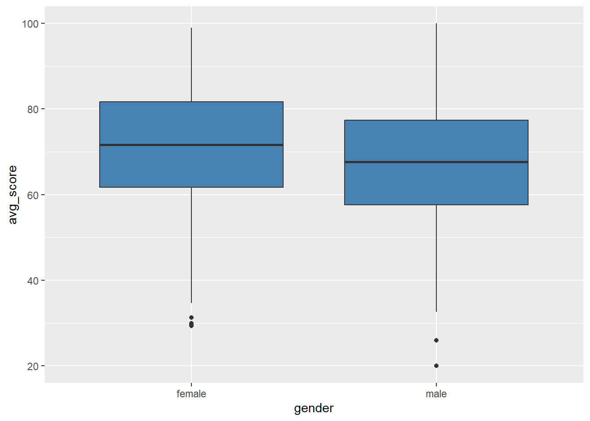{width=672}
:::

::: {.cell-output-display}
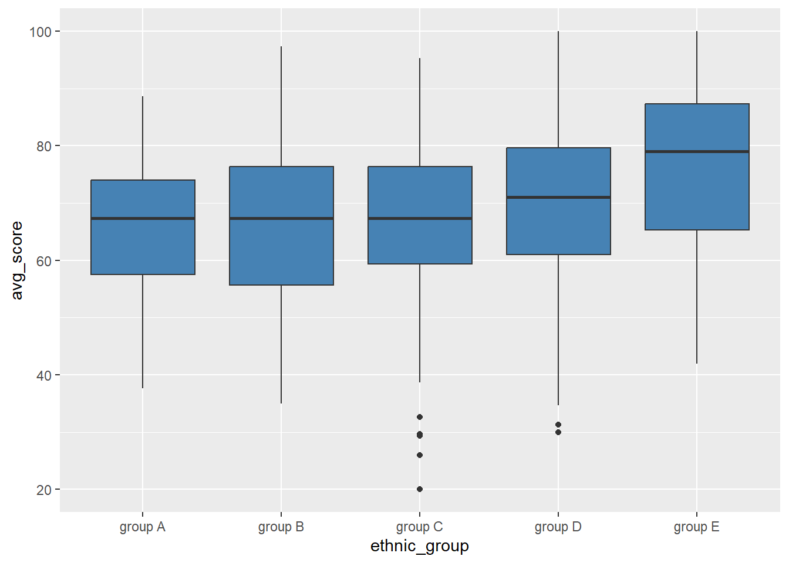{width=672}
:::

::: {.cell-output-display}
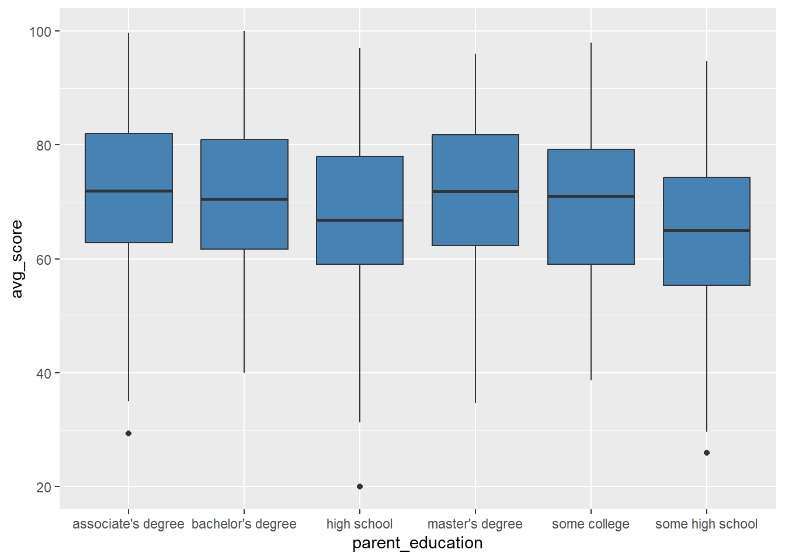{width=672}
:::

::: {.cell-output-display}
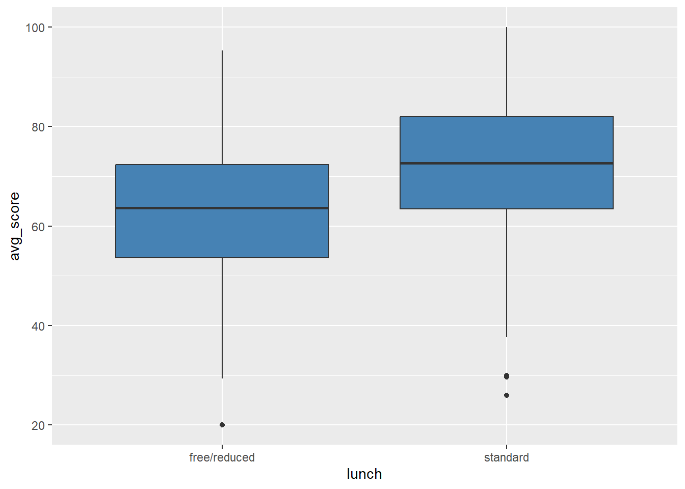{width=672}
:::

::: {.cell-output-display}
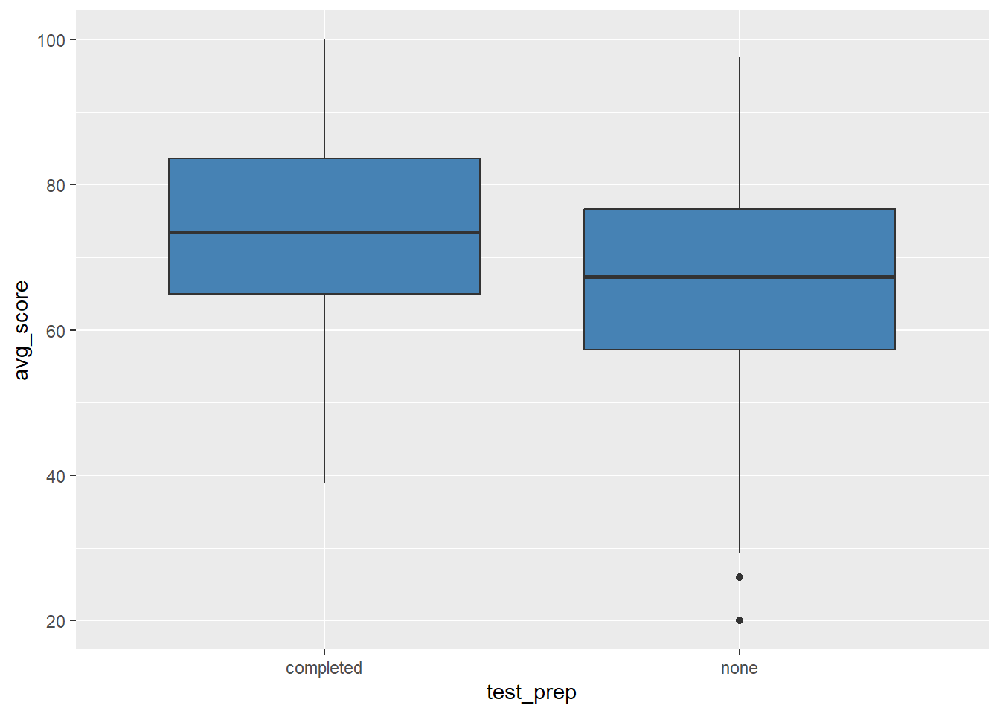{width=672}
:::
:::


It can be seen that there are certain outliers included in the available data. These outliers are certain students who performed very bad in the exams. The training data contains outliers, these are defined as observations which are far from the others. Outlier detection estimators thus try to fit the regions where the training data is the most concentrated, ignoring the deviant observations.

These outliers make it hard for the later model to predict the result correctly. The learning from this chapter shall be included in the later model creation.

## Feature engineering

All topics which were learned/discovered within the earlier steps shall be used now for the data preprocessing and feature engineering. This will be made with data pipelines. Those are generated with the tidymodels package *recipes* and *workflows*. The feature selection part wont be included here, as the features are selected within the modeling part (Forward selection in order to determine the best features). So the recipe will include all available features for a base model. In the model chapter the Feature Selection will be made with the available packages and tools in R.

### Feature transformation

Target of feature transformations - for this project and maybe new data in the future is to get red of:

-   missing values
-   outliers
-   categorical variables --\> one hot encoding

Other datasets would need further steps which do not apply in this project due to the data structure. Those other steps could be:

-   get data on the same scale

-   standardize the data

-   handle skewed distribution of data

-   take care if the data might be censored at certain limits (e.g. at the low and or high of the data)

**Missing values:** As we do not have any missing data in the data set, this step could be skipped. But in case that there might be newer data in the future which could have missing data, this should be added to the pipeline. There are three ways to handle missing data: Delete the observation with missing data, remove the whole attribute or impute it with some other values, e.g. the mean, median, etc. For this project missing data shall be dropped within the pipeline.

**Outliers:** Some outliers are included in the data set. For handling those the target is to test the experimental 3-rd party package from [*tidy_outlier*](https://github.com/brunocarlin/tidy.outliers)

**One-Hot_encoding:** Our available categorical data needs to be converted to numbers as algorithms prefer to work with numbers. For this the tidy models [step_dummy](https://recipes.tidymodels.org/articles/Dummies.html) function will be used.

### Feature extraction

Some features might include relevant information which could be redundant. That would be there wont be any benefit in adding both features in the model, if the target variable can be determined with one of those.

Therefore it makes sense to remove features which have large correlations with each other. But this is more likely at numeric features. In the feature extraction this can be made by using the ratio of two predictors or with more complex methods like principal component analysis.

This also makes sense to use in case that the number of features is high.

For this usecase this is only partly applicable, as there are only categorical features available.

### Final data pipeline

In the following pipeline all steps for the feature engineering are included:


::: {.cell}

```{.r .cell-code}
#devtools::install_github("brunocarlin/tidy.outliers") 

```
:::

::: {.cell}

```{.r .cell-code}
library(tidy.outliers)
library(recipes)
exam_rec <-
  recipe(avg_score ~ +gender  + ethnic_group + parent_education + lunch + test_prep, data = train_data) %>% #definition of features and target variable
  step_naomit(everything(), skip = TRUE) %>% #remove missing observations
  step_dummy(all_nominal()) %>% #converts factors into numeric binary (0 and 1) variables
  step_outliers_maha(all_numeric(), -all_outcomes()) %>%
  step_outliers_lookout(all_numeric(),-contains(r"(.outliers)"),-all_outcomes()) %>% #identify outliers
  step_outliers_remove(contains(r"(.outliers)")) %>% #remove outliers
  step_corr(all_predictors(), threshold = 0.7, method = "spearman") # remove correlated features (maybe not necessary as only character features as input)
```
:::


Lets have a look on the current set of variables and roles:


::: {.cell}

```{.r .cell-code}

summary(exam_rec)
## # A tibble: 6 × 4
##   variable         type      role      source  
##   <chr>            <list>    <chr>     <chr>   
## 1 gender           <chr [3]> predictor original
## 2 ethnic_group     <chr [3]> predictor original
## 3 parent_education <chr [3]> predictor original
## 4 lunch            <chr [3]> predictor original
## 5 test_prep        <chr [3]> predictor original
## 6 avg_score        <chr [2]> outcome   original
```
:::


Lets check if all preprocessing steps worked as intended:


::: {.cell}

```{.r .cell-code}

prepped_data <- 
  exam_rec %>% # use the recipe object
  prep() %>% # perform the recipe on training data
  juice() # extract only the preprocessed dataframe 

glimpse(prepped_data)
## Rows: 795
## Columns: 13
## $ avg_score                          <dbl> 55.00000, 50.66667, 53.66667, 48.33…
## $ gender_male                        <dbl> 0, 1, 1, 1, 0, 1, 0, 0, 1, 0, 0, 0,…
## $ ethnic_group_group.B               <dbl> 1, 1, 0, 0, 0, 0, 0, 0, 0, 1, 1, 0,…
## $ ethnic_group_group.C               <dbl> 0, 0, 1, 0, 1, 0, 0, 0, 1, 0, 0, 1,…
## $ ethnic_group_group.D               <dbl> 0, 0, 0, 0, 0, 1, 1, 0, 0, 0, 0, 0,…
## $ ethnic_group_group.E               <dbl> 0, 0, 0, 1, 0, 0, 0, 0, 0, 0, 0, 0,…
## $ parent_education_bachelor.s.degree <dbl> 0, 0, 0, 0, 0, 0, 0, 0, 0, 0, 0, 0,…
## $ parent_education_high.school       <dbl> 0, 0, 0, 0, 0, 1, 0, 0, 0, 1, 0, 0,…
## $ parent_education_master.s.degree   <dbl> 0, 1, 1, 1, 0, 0, 1, 0, 0, 0, 0, 0,…
## $ parent_education_some.college      <dbl> 0, 0, 0, 0, 1, 0, 0, 0, 0, 0, 0, 0,…
## $ parent_education_some.high.school  <dbl> 1, 0, 0, 0, 0, 0, 0, 1, 0, 0, 0, 1,…
## $ lunch_standard                     <dbl> 1, 1, 0, 0, 0, 0, 0, 1, 0, 1, 0, 1,…
## $ test_prep_none                     <dbl> 1, 1, 1, 1, 1, 1, 1, 1, 0, 1, 1, 1,…
```
:::


The recipe was successful! The character columns were successfully changed to dummy variables, so that the models can work with them. Moreover three observations were removed as they were identified as outliers.

Moreover a validation set shall be created. This shall be used to validate the later models. After the best model is used (based on the validation set) the model can be tested with the test data. The amount of breaks is the value which was learned in the Data Visualization chapter.


::: {.cell}

```{.r .cell-code}
set.seed(12)

cv_folds <- 
  vfold_cv(train_data,
           v=5,
           strata = y_label,
           breaks = 6)
```
:::


# Model

After the data and features have been preprocessed in a format which is ready for the modeling algorithms, they can be used in the model selection process.

Target for the Model and Deployment phase is to perform all steps in the usual way with tidymodels and afterwards one time by using MLFfow.

## Select algorithm

The target is to predict the *avg_score* of students in exams. This outcome variable is numeric. Therefore a **Regression** model needs to be selected for this usecase. As labeled data is available a supervised learning is performed. The following page is used to select three different model types and their engines: [Tidymodels: Search parsnip models](https://www.tidymodels.org/find/parsnip/)

Three different kind of models shall be selected in order to see how the performance of them differentiates and which is handling the available data the best.

The following three models were selected:

-   Boosted Tree (XGBoost)

    -   Decision trees would be good for modelling non linear relationships, as we only have categorical variables this might be useful.

    -   Risk of overfitting on the training data --\> Implement cross-validation in order to prevent this.

    -   Boosted tree is an ensembeld learner which starts with simple base models and tries to "boost" their aggregate complexity --\> In practice often with a high performance for the results.

-   Linear Regression (~~Keras~~ - changed to glmnet as I had issues to get keras and tensorflow running. For this a python installation and connection is needed)

    -   Faster to train and are simpler. Linear algorithms might get issues if the data has many intersecting correlations, but this is not the case in this dataset.

    -   Fits normally a "straight line" on the data --\> perfectly for our target variable.

    -   Disadvantage: Prone to overfit with many input features and are not that good in expressing non-linear relationships --\> Both does not apply for this dataset, but only categorical input data is available.

-   Single layer neural network (~~Keras~~ - changed to nnet, see above)

    -   Can recognize patterns by itself.

    -   Good for complex datasets --\> our dataset is quite simple

    -   Sadly it is not really possible to find out why the model has decided for the output. Also hyperparameter tuning is not that easy.

Sources: [Elite Datascience: Model Selection](https://elitedatascience.com/algorithm-selection), [Towards Datascience: Algorithm selection](https://towardsdatascience.com/do-you-know-how-to-choose-the-right-machine-learning-algorithm-among-7-different-types-295d0b0c7f60)

## Model Specification

Regarding the model specification three steps need to be made:

1.  Pick a model type (see above)
2.  Set the engine (see above)
3.  Set the mode regression (as the target is to perform a regression)

The further chapters are based on the documentation of the following pages:

-   [Tidymodels: Bossted Tree](https://parsnip.tidymodels.org/reference/boost_tree.html)

-   [Tidymodels: Linear Regression](https://parsnip.tidymodels.org/reference/linear_reg.html)

-   [Tidymodels: Single layer neural network](https://parsnip.tidymodels.org/reference/mlp.html)

-   [Tidymodels: Tune](https://tune.tidymodels.org)

### Boosted Tree

At first the target is to keep the model simple, that's why the model will be created with standard settings:


::: {.cell}

```{.r .cell-code}
library(tidymodels)
library(xgboost)
xgb_spec_1 <- 
  boost_tree() %>% 
  set_engine("xgboost") %>% 
  set_mode("regression") 
```
:::


Add the created model into a workflow:


::: {.cell}

```{.r .cell-code}

xgb_workflow_1 <-
  workflow() %>%
  add_recipe(exam_rec) %>%
  add_model(xgb_spec_1)
```
:::


### Linear Regression

At first the target is to keep the model simple, that's why the model will be created with standard settings:


::: {.cell}

```{.r .cell-code}
library(keras)
library(tensorflow)
lin_spec_1 <- 
  linear_reg(penalty = 0.1, mixture = 1) %>% 
  set_engine("glmnet") %>% 
  set_mode("regression") 
```
:::


Add the created model into a workflow:


::: {.cell}

```{.r .cell-code}

lin_reg_workflow_1 <-
  workflow() %>%
  add_recipe(exam_rec) %>%
  add_model(lin_spec_1)
```
:::


### Single Layer Neural Network

At first the target is to keep the model simple, that's why the model will be created with standard settings:


::: {.cell}

```{.r .cell-code}

neural_spec_1 <- 
  mlp() %>% 
  set_engine("nnet") %>% 
  set_mode("regression") 
```
:::


Add the created model into a workflow:


::: {.cell}

```{.r .cell-code}

neural_workflow_1 <-
  workflow() %>%
  add_recipe(exam_rec) %>%
  add_model(neural_spec_1)
```
:::


## Model training & evaluation

### Boosted tree


::: {.cell}

```{.r .cell-code}
set.seed(50)

xgb_res_1 <-
  xgb_workflow_1 %>%
  fit_resamples(
    resamples = cv_folds,
                control = control_resamples(save_pred = TRUE)
  )
xgb_res_1 %>% collect_metrics(summarize = TRUE)
## # A tibble: 2 × 6
##   .metric .estimator   mean     n std_err .config             
##   <chr>   <chr>       <dbl> <int>   <dbl> <chr>               
## 1 rmse    standard   13.0       5  0.225  Preprocessor1_Model1
## 2 rsq     standard    0.176     5  0.0149 Preprocessor1_Model1
```
:::


How are these metrics spreading through the cross_validation:


::: {.cell}

```{.r .cell-code}
xgb_res_1 %>% collect_metrics(summarize = FALSE)
## # A tibble: 10 × 5
##    id    .metric .estimator .estimate .config             
##    <chr> <chr>   <chr>          <dbl> <chr>               
##  1 Fold1 rmse    standard      12.3   Preprocessor1_Model1
##  2 Fold1 rsq     standard       0.220 Preprocessor1_Model1
##  3 Fold2 rmse    standard      12.8   Preprocessor1_Model1
##  4 Fold2 rsq     standard       0.178 Preprocessor1_Model1
##  5 Fold3 rmse    standard      13.3   Preprocessor1_Model1
##  6 Fold3 rsq     standard       0.183 Preprocessor1_Model1
##  7 Fold4 rmse    standard      13.6   Preprocessor1_Model1
##  8 Fold4 rsq     standard       0.127 Preprocessor1_Model1
##  9 Fold5 rmse    standard      13.0   Preprocessor1_Model1
## 10 Fold5 rsq     standard       0.170 Preprocessor1_Model1
```
:::


There are some smaller differences between these folds, but overall those differences are not to big.

Lets visualize these metrics into a plot. For this the predictions are plotted on the y-axis and the actual values on the x-axis. If a perfect model would have been created, all points would be on the diagonal line


::: {.cell}

```{.r .cell-code}

assess_xgb_res_1 <- collect_predictions(xgb_res_1)

assess_xgb_res_1 %>% 
  ggplot(aes(x = avg_score, y = .pred)) +   geom_point(alpha = .15) +
  geom_abline(col = "blue") + 
  coord_obs_pred() + 
  ylab("Predicted") +
  xlab("Actual Average Exam Score")
```

::: {.cell-output-display}
{width=672}
:::
:::


If we consider that this is the first created model and that there are only categorical features in the dataset, this result (RMSE) not that bad, but the R squared is low. Lets see in the next chapter how the Boosted Tree Performance can be increased. Further steps are to adapt the hyperparameters and the features which are added into the model.

### Linear Regression


::: {.cell}

```{.r .cell-code}
set.seed(50)

lin_reg_res_1 <-
  lin_reg_workflow_1 %>%
  fit_resamples(
    resamples = cv_folds,
                control = control_resamples(save_pred = TRUE)
  )

lin_reg_res_1 %>% collect_metrics(summarize = TRUE)
## # A tibble: 2 × 6
##   .metric .estimator   mean     n std_err .config             
##   <chr>   <chr>       <dbl> <int>   <dbl> <chr>               
## 1 rmse    standard   12.1       5  0.290  Preprocessor1_Model1
## 2 rsq     standard    0.261     5  0.0238 Preprocessor1_Model1
```
:::


How are these metrics spreading through the cross_validation:


::: {.cell}

```{.r .cell-code}
lin_reg_res_1 %>% collect_metrics(summarize = FALSE)
## # A tibble: 10 × 5
##    id    .metric .estimator .estimate .config             
##    <chr> <chr>   <chr>          <dbl> <chr>               
##  1 Fold1 rmse    standard      11.6   Preprocessor1_Model1
##  2 Fold1 rsq     standard       0.288 Preprocessor1_Model1
##  3 Fold2 rmse    standard      11.7   Preprocessor1_Model1
##  4 Fold2 rsq     standard       0.288 Preprocessor1_Model1
##  5 Fold3 rmse    standard      12.8   Preprocessor1_Model1
##  6 Fold3 rsq     standard       0.227 Preprocessor1_Model1
##  7 Fold4 rmse    standard      12.8   Preprocessor1_Model1
##  8 Fold4 rsq     standard       0.185 Preprocessor1_Model1
##  9 Fold5 rmse    standard      11.6   Preprocessor1_Model1
## 10 Fold5 rsq     standard       0.315 Preprocessor1_Model1
```
:::


There are some smaller differences between these folds, but overall those differences are not to big. Overall these metrics changed compared to the simple XGBoost model. The First model had a higher RMSE and a lower RSQ value.

Lets visualize these metrics into a plot. For this the predictions are plotted on the y-axis and the actual values on the x-axis. If a perfect model would have been created, all points would be on the diagonal line


::: {.cell}

```{.r .cell-code}

assess_lin_reg_res_1 <- collect_predictions(lin_reg_res_1)

assess_lin_reg_res_1 %>% 
  ggplot(aes(x = avg_score, y = .pred)) +   geom_point(alpha = .15) +
  geom_abline(col = "blue") + 
  coord_obs_pred() + 
  ylab("Predicted") +
  xlab("Actual Average Exam Score")
```

::: {.cell-output-display}
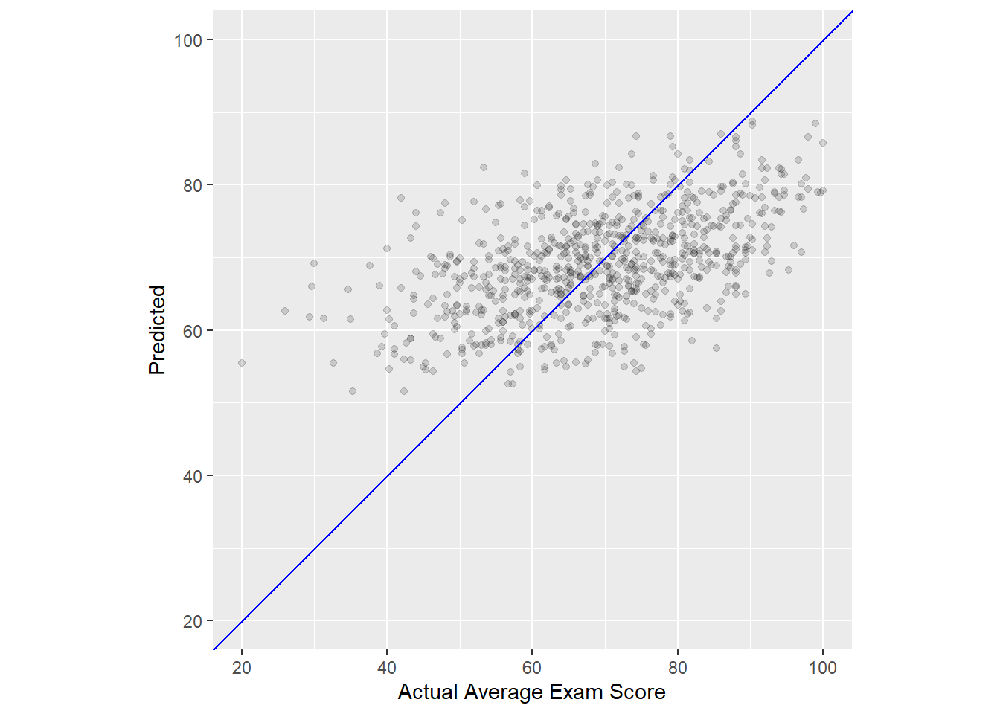{width=672}
:::
:::


### Single Layer Perceptron


::: {.cell}

```{.r .cell-code}
set.seed(50)

neural_res_1 <-
  neural_workflow_1 %>%
  fit_resamples(
    resamples = cv_folds,
                control = control_resamples(save_pred = TRUE)
  )
neural_res_1 %>% collect_metrics(summarize = TRUE)
## # A tibble: 2 × 6
##   .metric .estimator   mean     n std_err .config             
##   <chr>   <chr>       <dbl> <int>   <dbl> <chr>               
## 1 rmse    standard   13.3       5  0.339  Preprocessor1_Model1
## 2 rsq     standard    0.177     3  0.0271 Preprocessor1_Model1
```
:::


How are these metrics spreading through the cross_validation:


::: {.cell}

```{.r .cell-code}
neural_res_1 %>% collect_metrics(summarize = FALSE)
## # A tibble: 10 × 5
##    id    .metric .estimator .estimate .config             
##    <chr> <chr>   <chr>          <dbl> <chr>               
##  1 Fold1 rmse    standard      13.7   Preprocessor1_Model1
##  2 Fold1 rsq     standard      NA     Preprocessor1_Model1
##  3 Fold2 rmse    standard      12.3   Preprocessor1_Model1
##  4 Fold2 rsq     standard       0.223 Preprocessor1_Model1
##  5 Fold3 rmse    standard      13.6   Preprocessor1_Model1
##  6 Fold3 rsq     standard       0.129 Preprocessor1_Model1
##  7 Fold4 rmse    standard      14.2   Preprocessor1_Model1
##  8 Fold4 rsq     standard      NA     Preprocessor1_Model1
##  9 Fold5 rmse    standard      12.9   Preprocessor1_Model1
## 10 Fold5 rsq     standard       0.177 Preprocessor1_Model1
```
:::


There are some smaller differences between these folds, but overall those differences are not to big.

This model has the highest RSME score. The RSQ score is similar to the result of the XGBoost.

Lets visualize these metrics into a plot. For this the predictions are plotted on the y-axis and the actual values on the x-axis. If a perfect model would have been created, all points would be on the diagonal line


::: {.cell}

```{.r .cell-code}

assess_neural_res_1 <- collect_predictions(neural_res_1)

assess_xgb_res_1 %>% 
  ggplot(aes(x = avg_score, y = .pred)) +   geom_point(alpha = .15) +
  geom_abline(col = "blue") + 
  coord_obs_pred() + 
  ylab("Predicted") +
  xlab("Actual Average Exam Score")
```

::: {.cell-output-display}
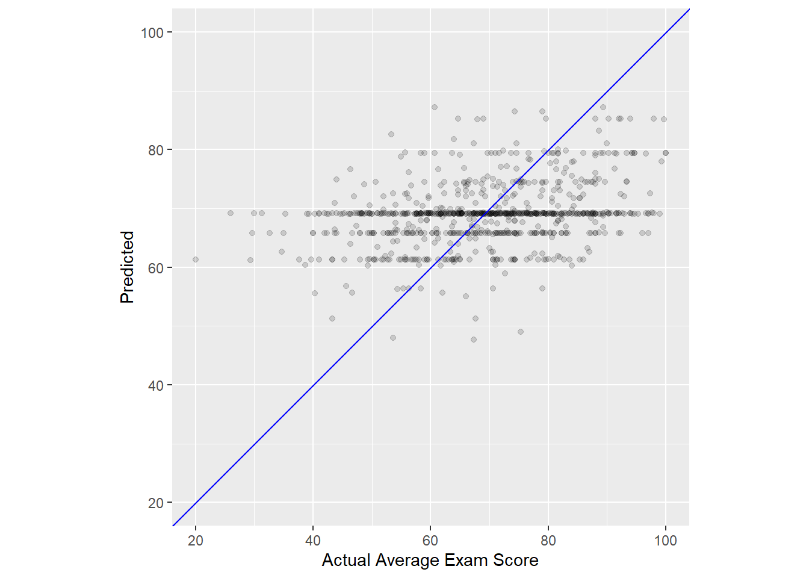{width=672}
:::
:::


## Feature Selection

After the initial models were created and their results were visualized, lets have a look on the feature importance's. Currently all available features were used for the model creation. Therefore lets analyze the Feature Importance and maybe it might be better to remove some features.


::: {.cell}

```{.r .cell-code}

# ensure results are repeatable
set.seed(50)
# load the library
library(mlbench)
library(caret)
# load the dataset
data(train_data)
# prepare training scheme
control <- trainControl(method="repeatedcv", number=10, repeats=3)
# train the model
model <- train(avg_score~ ., data=train_data, method="pls", preProcess="scale", trControl=control)
# estimate variable importance
importance <- varImp(model, scale=FALSE)
# summarize importance
print(importance)
## pls variable importance
## 
##                                     Overall
## reading_score                       4.40236
## writing_score                       4.36047
## math_score                          4.16323
## lunchstandard                       1.44992
## test_prepnone                       1.10585
## `ethnic_groupgroup E`               0.98925
## gendermale                          0.59114
## `parent_educationsome high school`  0.57987
## `ethnic_groupgroup B`               0.45876
## `ethnic_groupgroup C`               0.44201
## `parent_educationbachelor's degree` 0.32318
## `parent_educationhigh school`       0.29171
## `ethnic_groupgroup D`               0.23756
## `parent_educationmaster's degree`   0.19733
## `parent_educationsome college`      0.09161
# plot importance
plot(importance)
```

::: {.cell-output-display}
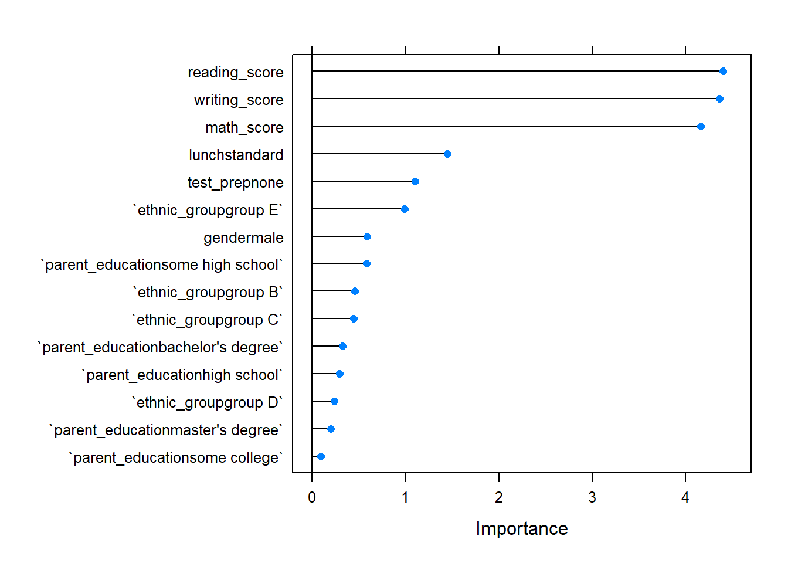{width=672}
:::
:::


It can be seen that the other exam scores are having the biggest influence on the average score - which totally makes sense as these variables are the basis for this variable. This is exactly why they need to be removed from the modelling, even though they have a huge feature importance.

Beside these variables the most important features are the `lunch` and `test_preparation`variables. Also an important features seems to be the `ethnic_group` but only for one level (Group E). The other levels have only a very small influence on the result. Also the `gender` variable seems to be a bit important. The lowest feature importance is brought in by the `parent_education` as most of the levels have only a very small Importance. This result is matching the learning from the data visualization. In that chapter it was learned the most of the other levels have only a small impact on the average exam score.

**Forward Selection**

Lets make a simple model in which a Forward selection if performed. The result of this shall determine the variables which shall be used in all models.


::: {.cell}

```{.r .cell-code}
# Set seed for reproducibility
set.seed(50)
# Set up repeated k-fold cross-validation
train.control <- trainControl(method = "cv", number = 50)
# Train the model
step.model <- train(avg_score ~ gender + ethnic_group + parent_education + lunch + test_prep, data = train_data,
                    method = "leapForward", 
                    tuneGrid = data.frame(nvmax = 1:5), # only add 5 variables - we only have 5 in the data
                    trControl = train.control
                    )
step.model$results
##   nvmax     RMSE  Rsquared      MAE   RMSESD RsquaredSD    MAESD
## 1     1 13.24565 0.1390763 10.85628 1.724771  0.1253628 1.404933
## 2     2 12.70180 0.2215130 10.48467 1.867817  0.1835467 1.635797
## 3     3 12.34800 0.2499183 10.17653 1.836641  0.1850143 1.617479
## 4     4 12.19919 0.2660067 10.09570 1.794291  0.1793756 1.605500
## 5     5 12.19822 0.2684751 10.08568 1.890109  0.1707500 1.664600
```
:::


It can be seen that we get the best scores for RMSE and R squared are achieved if all variables are added into the model. But the difference between 3, 4 and 5 variables is very small. Moreover there is no consideration of the adjusted R squared. R squared is increasing most times if additional variables are added into the model while the adjusted R squared is adding a penalty for this.

Nevertheless we will continue with the model which has the highest R squared and RMSE score. It needs to be added that both of these values are not that good.

Lets display the best tuning values (nvmax) selected by the train() function.


::: {.cell}

```{.r .cell-code}
step.model$bestTune
##   nvmax
## 5     5
```
:::


Result from Forward selection is to use all 5 variables for modelling.

Lets check in which order these variables are selected. This can be seen by the \* in the corresponding selection step.


::: {.cell}

```{.r .cell-code}
summary(step.model$finalModel)
## Subset selection object
## 12 Variables  (and intercept)
##                                   Forced in Forced out
## gendermale                            FALSE      FALSE
## ethnic_groupgroup B                   FALSE      FALSE
## ethnic_groupgroup C                   FALSE      FALSE
## ethnic_groupgroup D                   FALSE      FALSE
## ethnic_groupgroup E                   FALSE      FALSE
## parent_educationbachelor's degree     FALSE      FALSE
## parent_educationhigh school           FALSE      FALSE
## parent_educationmaster's degree       FALSE      FALSE
## parent_educationsome college          FALSE      FALSE
## parent_educationsome high school      FALSE      FALSE
## lunchstandard                         FALSE      FALSE
## test_prepnone                         FALSE      FALSE
## 1 subsets of each size up to 5
## Selection Algorithm: forward
##          gendermale ethnic_groupgroup B ethnic_groupgroup C ethnic_groupgroup D
## 1  ( 1 ) " "        " "                 " "                 " "                
## 2  ( 1 ) " "        " "                 " "                 " "                
## 3  ( 1 ) " "        " "                 " "                 " "                
## 4  ( 1 ) " "        " "                 " "                 " "                
## 5  ( 1 ) "*"        " "                 " "                 " "                
##          ethnic_groupgroup E parent_educationbachelor's degree
## 1  ( 1 ) " "                 " "                              
## 2  ( 1 ) " "                 " "                              
## 3  ( 1 ) "*"                 " "                              
## 4  ( 1 ) "*"                 " "                              
## 5  ( 1 ) "*"                 " "                              
##          parent_educationhigh school parent_educationmaster's degree
## 1  ( 1 ) " "                         " "                            
## 2  ( 1 ) " "                         " "                            
## 3  ( 1 ) " "                         " "                            
## 4  ( 1 ) " "                         " "                            
## 5  ( 1 ) " "                         " "                            
##          parent_educationsome college parent_educationsome high school
## 1  ( 1 ) " "                          " "                             
## 2  ( 1 ) " "                          " "                             
## 3  ( 1 ) " "                          " "                             
## 4  ( 1 ) " "                          "*"                             
## 5  ( 1 ) " "                          "*"                             
##          lunchstandard test_prepnone
## 1  ( 1 ) "*"           " "          
## 2  ( 1 ) "*"           "*"          
## 3  ( 1 ) "*"           "*"          
## 4  ( 1 ) "*"           "*"          
## 5  ( 1 ) "*"           "*"
```
:::


Below is the result summed up. The rank of the most important features is:

1.  Lunch
2.  Test preparation
3.  ethnic_group
4.  parent_education
5.  gender

For better results of the model it would make sense to have a deeper analysis of the adjusted R squared score for the added variables. Moreover it would probably make sense to reduce the amount of levels in the variables. For example some ethnic groups have almost no difference between their performance on the average exam score.

## Model Tuning

This chapter will cover the possibilities of model tuning. For this the three created basis models will be tuned. In the first step the adaption of parameters is made manually. In the second step the tune package is used. For the model performance only the numeric results will be compared. No further analysis of the visualization of model results will be made. At the end the model with the best performance will be used to make a final fit on the training data.

As a comparison a model which only contains the mean will be created. This will be used as a simple comparison if the created model performs better than a simple guess of the mean for all exam scores.

### Boosted Tree

For the Boosted Tree the following hyperparameters shall be adapted:

-   Trees: Amount of trees in the ensemble - default 15

-   Tree_depth: Maximal depth of the tree (e.g number of splits) - default 6

-   min_n; minimum amount of data points for a further split - default 1

-   Learn_rate: Learn-rate at which the algorithm adapts from iteration to iteration - default 0.3

-   Loss_reduction: Minimum loss reduction - default 0.0

Source: [Boosted trees via xgboost](https://parsnip.tidymodels.org/reference/details_boost_tree_xgboost.html)

At first manually the hyper parameters are adapted and the result will be checked.

First of all the model will be specified:


::: {.cell}

```{.r .cell-code}
xgb_spec_2 <- 
  boost_tree(
    trees = 30,
    tree_depth = 4,
    min_n = 8,
    learn_rate = 0.2,
    loss_reduction = 0.05) %>% 
  set_engine("xgboost") %>% 
  set_mode("regression") 
```
:::


Afterwards the new model will be added to the workflow with the created recipe


::: {.cell}

```{.r .cell-code}

xgb_workflow_2 <-
  workflow() %>%
  add_recipe(exam_rec) %>%
  add_model(xgb_spec_2)
```
:::

::: {.cell}

```{.r .cell-code}
set.seed(50)

xgb_res_2 <-
  xgb_workflow_2 %>%
  fit_resamples(
    resamples = cv_folds,
                control = control_resamples(save_pred = TRUE)
  )
xgb_res_2 %>% collect_metrics(summarize = TRUE)
## # A tibble: 2 × 6
##   .metric .estimator   mean     n std_err .config             
##   <chr>   <chr>       <dbl> <int>   <dbl> <chr>               
## 1 rmse    standard   12.5       5  0.255  Preprocessor1_Model1
## 2 rsq     standard    0.217     5  0.0186 Preprocessor1_Model1
```
:::


The model performance improved by adapting the hyper parameters. The RMSE score could be reduced by 0.5. Now lets try it with the tune package.

The hyperparameter tuning is based on the following documentations:

-   [Tidymodels: Tuning](https://www.tidymodels.org/start/tuning/)

-   [Tidymodels: Tune SVM](https://www.tidymodels.org/learn/work/tune-svm/) --\> includes also a generic approach

-   [Tidymodels: Tune](https://tune.tidymodels.org)

First of all a new model specification is created. In this the hyperparameters are specified which shall be tuned.

Note: Due to to many different model variations, I have decided to reduce the grid to a maximum of three hyper parameters. Instead of additional hyper parameters, it makes more sense to test more levels in between.


::: {.cell}

```{.r .cell-code}
xgb_spec_3 <- 
  boost_tree(
    trees = tune(),
    tree_depth = tune(),
    min_n = tune()) %>% 
  set_engine("xgboost") %>% 
  set_mode("regression") 
```
:::


Have a look on the tune spec:


::: {.cell}

```{.r .cell-code}
xgb_spec_3
## Boosted Tree Model Specification (regression)
## 
## Main Arguments:
##   trees = tune()
##   min_n = tune()
##   tree_depth = tune()
## 
## Computational engine: xgboost
```
:::


The `tune()` is like a placeholder. After the tuning process single numeric values are selected for each of the hyperparameter.

In the next steps several models are trained using resampled data. Afterwards it is checked which model performs best. For this a grid of values is created:


::: {.cell}

```{.r .cell-code}
xgboost_grid <- grid_regular(
  trees(),
  min_n(),
  tree_depth(),
  levels = 5
)
xgboost_grid
## # A tibble: 125 × 3
##    trees min_n tree_depth
##    <int> <int>      <int>
##  1     1     2          1
##  2   500     2          1
##  3  1000     2          1
##  4  1500     2          1
##  5  2000     2          1
##  6     1    11          1
##  7   500    11          1
##  8  1000    11          1
##  9  1500    11          1
## 10  2000    11          1
## # ℹ 115 more rows
```
:::


In total 125 different models with different hyperparameters were specified.

Everything is ready to tune. `tune_grid` can be used to fit models for all different hyperparameters.

Define the workflow with the model and recipe.


::: {.cell}

```{.r .cell-code}

xgb_workflow_3 <-
  workflow() %>%
  add_recipe(exam_rec) %>%
  add_model(xgb_spec_3)
```
:::


Calculate the results with tune_grid.


::: {.cell}

```{.r .cell-code}
set.seed(50)

xgb_res_3 <-
  xgb_workflow_3 %>%
  tune_grid(
    resamples = cv_folds,
    grid = xgboost_grid,
                control = control_resamples(save_pred = TRUE)
  )
```
:::


The results of this can be filtered so that only the best 5 shall be displayed:


::: {.cell}

```{.r .cell-code}
xgb_res_3 %>%
  show_best("rmse")
## # A tibble: 5 × 9
##   trees min_n tree_depth .metric .estimator  mean     n std_err .config         
##   <int> <int>      <int> <chr>   <chr>      <dbl> <int>   <dbl> <chr>           
## 1   500     2          1 rmse    standard    12.1     5   0.306 Preprocessor1_M…
## 2   500    11          1 rmse    standard    12.1     5   0.306 Preprocessor1_M…
## 3   500    21          1 rmse    standard    12.1     5   0.306 Preprocessor1_M…
## 4   500    30          1 rmse    standard    12.1     5   0.306 Preprocessor1_M…
## 5   500    40          1 rmse    standard    12.1     5   0.306 Preprocessor1_M…
```
:::


Moreover a selection for the best tree can be made. With that the single set with the best hyperparameters is selected:


::: {.cell}

```{.r .cell-code}
xgboost_best <- xgb_res_3 %>%
  select_best("rmse")
xgboost_best
## # A tibble: 1 × 4
##   trees min_n tree_depth .config               
##   <int> <int>      <int> <chr>                 
## 1   500     2          1 Preprocessor1_Model002
```
:::


The hyper parameter optimization with the tune package increased the RMSE a lot compared to the initial model. It has also increased to the manual selected hyper parameters.

But it has to be said that I am skeptical regarding the selected best hyper parameters... Tree_depth of one and a min_n of two do not seem to be robust for new data... Probably the model is overfitting.

### Linear regression

For the Linear Regression model the following hyper parameters shall be adapted:

-   Penalty: Amount of regularization - has no default and requires a single numeric value

-   Mixture: Proportion of lasso penalty - default 1.0

Source: [Linear regression via glmnet](https://parsnip.tidymodels.org/reference/details_linear_reg_glmnet.html)

At first manually the hyper parameters are adapted and the result will be checked.

First of all the model will be specified:


::: {.cell}

```{.r .cell-code}
lin_spec_2 <- 
  linear_reg(penalty = 0.3, mixture = 0.7) %>% 
  set_engine("glmnet") %>% 
  set_mode("regression") 
```
:::


Afterwards the new model will be added to the workflow with the created recipe


::: {.cell}

```{.r .cell-code}

lin_workflow_2 <-
  workflow() %>%
  add_recipe(exam_rec) %>%
  add_model(lin_spec_2)
```
:::

::: {.cell}

```{.r .cell-code}
set.seed(50)

lim_res_2 <-
  lin_workflow_2 %>%
  fit_resamples(
    resamples = cv_folds,
                control = control_resamples(save_pred = TRUE)
  )
lim_res_2 %>% collect_metrics(summarize = TRUE)
## # A tibble: 2 × 6
##   .metric .estimator   mean     n std_err .config             
##   <chr>   <chr>       <dbl> <int>   <dbl> <chr>               
## 1 rmse    standard   12.1       5  0.278  Preprocessor1_Model1
## 2 rsq     standard    0.259     5  0.0227 Preprocessor1_Model1
```
:::


The model performance was not improved... Now lets try it with the tune package.

First of all a new model specification is created. In this the hyperparameters are specified which shall be tuned.


::: {.cell}

```{.r .cell-code}
lin_spec_3 <- 
  linear_reg(
    penalty = tune(),
    mixture = tune()) %>% 
  set_engine("glmnet") %>% 
  set_mode("regression") 
```
:::


Have a look on the tune spec:


::: {.cell}

```{.r .cell-code}
lin_spec_3
## Linear Regression Model Specification (regression)
## 
## Main Arguments:
##   penalty = tune()
##   mixture = tune()
## 
## Computational engine: glmnet
```
:::


The `tune()` is like a placeholder. After the tuning process single numeric values are selected for each of the hyper parameter.

In the next steps several models are trained using resampeled data. Afterwards it is checked which model performs best. For this a grid of values is created:


::: {.cell}

```{.r .cell-code}
lin_grid <- grid_regular(
  penalty(),
  mixture(),
  levels = 5
)
lin_grid
## # A tibble: 25 × 2
##         penalty mixture
##           <dbl>   <dbl>
##  1 0.0000000001    0   
##  2 0.0000000316    0   
##  3 0.00001         0   
##  4 0.00316         0   
##  5 1               0   
##  6 0.0000000001    0.25
##  7 0.0000000316    0.25
##  8 0.00001         0.25
##  9 0.00316         0.25
## 10 1               0.25
## # ℹ 15 more rows
```
:::


In total 25 different models with different hyperparameters were specified.

Everything is ready to tune. `tune_grid` can be used to fit models for all different hyperparameters.

Define the workflow with the model and recipe.


::: {.cell}

```{.r .cell-code}

lin_workflow_3 <-
  workflow() %>%
  add_recipe(exam_rec) %>%
  add_model(lin_spec_3)
```
:::


Calculate the results with tune_grid.


::: {.cell}

```{.r .cell-code}
set.seed(50)

lin_res_3 <-
  lin_workflow_3 %>%
  tune_grid(
    resamples = cv_folds,
    grid = lin_grid,
                control = control_resamples(save_pred = TRUE)
  )
```
:::


The results of this can be filtered so that only the best 5 shall be displayed:


::: {.cell}

```{.r .cell-code}
lin_res_3 %>%
  show_best("rmse")
## # A tibble: 5 × 8
##        penalty mixture .metric .estimator  mean     n std_err .config           
##          <dbl>   <dbl> <chr>   <chr>      <dbl> <int>   <dbl> <chr>             
## 1 0.0000000001       0 rmse    standard    12.1     5   0.299 Preprocessor1_Mod…
## 2 0.0000000316       0 rmse    standard    12.1     5   0.299 Preprocessor1_Mod…
## 3 0.00001            0 rmse    standard    12.1     5   0.299 Preprocessor1_Mod…
## 4 0.00316            0 rmse    standard    12.1     5   0.299 Preprocessor1_Mod…
## 5 0.0000000001       1 rmse    standard    12.1     5   0.307 Preprocessor1_Mod…
```
:::


Moreover a selection for the best linear model can be made. With that the single set with the best hyper parameters is selected:


::: {.cell}

```{.r .cell-code}
lin_best <- lin_res_3 %>%
  select_best("rmse")
lin_best
## # A tibble: 1 × 3
##        penalty mixture .config              
##          <dbl>   <dbl> <chr>                
## 1 0.0000000001       0 Preprocessor1_Model01
```
:::


The hyper parameter optimization with the tune package increased the RMSE only by a minimum compared to the initial model. For the linear regression almost no improvement was possible.

The model performance is similar to the xgboost model which was tuned with the tune package.

### Single Layer Neural Network

For the Single Layer Neural Network the following hyperparameters shall be adapted:

-   hidden_units: #Hidden units - default 0

-   Penalty: Amount of regularization - default 0.0

-   epochs: Amount of epochs for training - default 100L

Source: [Multilayer perceptron via nnet](https://parsnip.tidymodels.org/reference/details_mlp_nnet.html)

At first manually the hyper parameters are adapted and the result will be checked.

First of all the model will be specified:


::: {.cell}

```{.r .cell-code}
neural_spec_2 <- 
  mlp(
    hidden_units = 5,
    penalty = 0.1,
    epochs = 200) %>% 
  set_engine("nnet") %>% 
  set_mode("regression") 
```
:::


Afterwards the new model will be added to the workflow with the created recipe


::: {.cell}

```{.r .cell-code}

neural_workflow_2 <-
  workflow() %>%
  add_recipe(exam_rec) %>%
  add_model(neural_spec_2)
```
:::

::: {.cell}

```{.r .cell-code}
set.seed(50)

neural_res_2 <-
  neural_workflow_2 %>%
  fit_resamples(
    resamples = cv_folds,
                control = control_resamples(save_pred = TRUE)
  )
neural_res_2 %>% collect_metrics(summarize = TRUE)
## # A tibble: 2 × 6
##   .metric .estimator   mean     n std_err .config             
##   <chr>   <chr>       <dbl> <int>   <dbl> <chr>               
## 1 rmse    standard   13.0       5  0.189  Preprocessor1_Model1
## 2 rsq     standard    0.178     5  0.0113 Preprocessor1_Model1
```
:::


The model performance improved a bit the hyper parameters. The RMSE score could be reduced by 0.3. Now lets try it with the tune package.

First of all a new model specification is created. In this the hyperparameters are specified which shall be tuned.


::: {.cell}

```{.r .cell-code}
neural_spec_3 <- 
  mlp(
    hidden_units = tune(),
    penalty = tune(),
    epochs = tune()) %>% 
  set_engine("nnet") %>% 
  set_mode("regression") 
```
:::


Have a look on the tune spec:


::: {.cell}

```{.r .cell-code}
neural_spec_3
## Single Layer Neural Network Model Specification (regression)
## 
## Main Arguments:
##   hidden_units = tune()
##   penalty = tune()
##   epochs = tune()
## 
## Computational engine: nnet
```
:::


The `tune()` is like a placeholder. After the tuning process single numeric values are selected for each of the hyper parameter.

In the next steps several models are trained using resampelled data. Afterwards it is checked which model performs best. For this a grid of values is created:


::: {.cell}

```{.r .cell-code}
neural_grid <- grid_regular(
  hidden_units(),
  penalty(),
  epochs(),
  levels = 5
)
neural_grid
## # A tibble: 125 × 3
##    hidden_units      penalty epochs
##           <int>        <dbl>  <int>
##  1            1 0.0000000001     10
##  2            3 0.0000000001     10
##  3            5 0.0000000001     10
##  4            7 0.0000000001     10
##  5           10 0.0000000001     10
##  6            1 0.0000000316     10
##  7            3 0.0000000316     10
##  8            5 0.0000000316     10
##  9            7 0.0000000316     10
## 10           10 0.0000000316     10
## # ℹ 115 more rows
```
:::


In total 125 different models with different hyperparameters were specified.

Everything is ready to tune. `tune_grid` can be used to fit models for all different hyperparameters.

Define the workflow with the model and recipe.


::: {.cell}

```{.r .cell-code}

neural_workflow_3 <-
  workflow() %>%
  add_recipe(exam_rec) %>%
  add_model(neural_spec_3)
```
:::


Calculate the results with tune_grid.


::: {.cell}

```{.r .cell-code}
set.seed(50)

neural_res_3 <-
  neural_workflow_3 %>%
  tune_grid(
    resamples = cv_folds,
    grid = neural_grid,
                control = control_resamples(save_pred = TRUE)
  )
```
:::


The results of this can be filtered so that only the best 5 shall be displayed:


::: {.cell}

```{.r .cell-code}
neural_res_3 %>%
  show_best("rmse")
## # A tibble: 5 × 9
##   hidden_units penalty epochs .metric .estimator  mean     n std_err .config    
##          <int>   <dbl>  <int> <chr>   <chr>      <dbl> <int>   <dbl> <chr>      
## 1            1 0.00001    505 rmse    standard    12.1     5   0.302 Preprocess…
## 2            1 1          505 rmse    standard    12.2     5   0.306 Preprocess…
## 3            1 1          257 rmse    standard    12.2     5   0.306 Preprocess…
## 4            1 1         1000 rmse    standard    12.2     5   0.308 Preprocess…
## 5            1 1          752 rmse    standard    12.2     5   0.308 Preprocess…
```
:::


Moreover a selection for the best result can be made. With that the single set with the best hyperparameters is selected:


::: {.cell}

```{.r .cell-code}
neural_best <- neural_res_3 %>%
  select_best("rmse")
neural_best
## # A tibble: 1 × 4
##   hidden_units penalty epochs .config               
##          <int>   <dbl>  <int> <chr>                 
## 1            1 0.00001    505 Preprocessor1_Model061
```
:::


The hyper parameter optimization with the tune package increased the RMSE a lot compared to the initial model. It has also increased to the manual selected hyper parameters.

The best models (based on lowest RMSE) are:

1.  RMSE: 12.10604 - Linear Regression
2.  RMSE: 12.10782 - XGBoost
3.  RMSE: 12.13196 - Neural Network

All models have very similar performance metrics and the differences are minor. But the RMSE score is still quite high and the R squared quite low\... Probably the available (only categorical) variables are not that good for predicting the performance of the students in the exams. This was also seen in the previous chapters with the R squared score which was only slightly above 0.25.

In the next step the best model will be fitted a last time on the training data before the deployment phase can be started.

For the final model the Linear regression models is chosen as it has one the one hand the best results and on the other hand the model is quite simple and is well suited for predicting linear relationships.

# Deployment

Within this chapter three different topics shall be made. On the one hand the model deployment via ventiver shall be made. For this the model shall be validated, deployed, etc...

Moreover, a dashbaord shall be created which displays the dataset and in which different visualizations can be made. It would be also possible to add there the model and make predictions within that Dashboard, but I do prefer to also have a look in the other tools instead of going very deep only in one tool. With that I am familiar with more tools and can decide in future which fits best for certain problems. The code for the dashboard is in a separate folder.

As third target of this chapter MLFlow shall be used for modeling, model monitoring etc.

## Validate model

In this chapter the best model from the modeling will be fitted on all training data instead of only the split cross-validation data set. The final fitted model can be deployed and validated on the test data.

Add the model with the best results to the defined workflow:


::: {.cell}

```{.r .cell-code}
workflow_best_model <-
  lin_workflow_3 %>%
  finalize_workflow(lin_best)
```
:::

::: {.cell}

```{.r .cell-code}
last_fit_model <- workflow_best_model %>% 
  last_fit(data_split)
```
:::

::: {.cell}

```{.r .cell-code}
last_fit_model %>%
    collect_metrics()
## # A tibble: 2 × 4
##   .metric .estimator .estimate .config             
##   <chr>   <chr>          <dbl> <chr>               
## 1 rmse    standard      12.8   Preprocessor1_Model1
## 2 rsq     standard       0.163 Preprocessor1_Model1
```
:::


The performance of the model on test data is worse than it was on the training data. The RMSE metric increased from 12.1 to 12.77. Probably the model was overfitted a bit on the training data. But the RMSE score is still better than for certain created models in the Modelling phase (on training data).

The R squared value is really low compared to the defined metrics at the project begin. It can be said that all created models are not fulfilling the defined metrics for a successful project. Nevertheless the model will be used for the deployment.

**Compare the model with a simple model which only predicts the mean:**


::: {.cell}

```{.r .cell-code}
mean_model_data <- train_data %>%
  mutate (mean = mean(avg_score))
mean_model_data
## # A tibble: 798 × 10
##    gender ethnic_group parent_education lunch test_prep math_score reading_score
##    <fct>  <fct>        <fct>            <fct> <fct>          <dbl>         <dbl>
##  1 female group B      some high school stan… none              46            61
##  2 male   group B      master's degree  stan… none              53            50
##  3 male   group C      master's degree  free… none              55            54
##  4 male   group E      master's degree  free… none              56            46
##  5 female group C      some college     free… none              35            47
##  6 male   group D      high school      free… none              58            52
##  7 female group D      master's degree  free… none              32            35
##  8 female group A      some high school stan… none              57            53
##  9 male   group C      associate's deg… free… completed         46            46
## 10 female group B      high school      stan… none              52            56
## # ℹ 788 more rows
## # ℹ 3 more variables: writing_score <dbl>, avg_score <dbl>, mean <dbl>
```
:::


Now lets see how this prediction is performing on the available data.


::: {.cell}

```{.r .cell-code}
library(Metrics)
RMSE(mean_model_data$avg_score, mean_model_data$mean)
## [1] 14.06398
```
:::


The RMSE score of a model which is only predicting the mean is worse than the created model. Even thought the difference is not that big...

As the created model is better than a simple model which only predicts the mean the project can continue and the deployment can be made.

Atleast the model is better than this simple one for comparison. If the set target was not achieved, this still shows that the created model is atleast better then only a mean prediction.

## Deploy model

Sources for Model deployment:

-   [Youtube Posit: MLOps with vetiver in Python and R](https://www.youtube.com/watch?v=oFQANK13-k4)

-   [Posit Solutions: MLOps with vetiver and Posit](https://solutions.posit.co/gallery/model-management/vetiver/)

-   [Github: End-to-End machine Learning Pipeline](https://github.com/sol-eng/bike_predict)

-   [Posit: End-to_end Data Science with RStudio Connect](https://colorado.posit.co/rsc/bike-predict-r-dashboard/document.html)

-   [Ventiver documentation](https://cran.r-project.org/web/packages/vetiver/vetiver.pdf)

-   [Plumber Documentation](https://www.rplumber.io/articles/introduction.html)

First of all a last fit of the created final model will be made. This is done as with the previous last fit the model is not compatible for deploying with vetiver. With this last fit on the training data the model fits to the requirements from vetiver


::: {.cell}

```{.r .cell-code}
last_fit_model_depl <- fit(workflow_best_model, data=train_data)
```
:::


In the next step the model name and pin name gets specified.

Moreover the model is defined. For this the vetiver package is used.


::: {.cell}

```{.r .cell-code}
library(vetiver)
library(glue)
library(rsconnect)
library(pins)
# define names for model and pin
model_name <- "Prediction_of_exam_score_model_r"
pin_name <- glue("daniel.steck/{model_name}")

v <- vetiver_model( #create vetiver model
  last_fit_model_depl, #model which performed the last fit
  model_name, #model name from above
  versioned = TRUE #versioning shall be made
)
v
## 
## ── Prediction_of_exam_score_model_r ─ <bundled_workflow> model for deployment 
## A glmnet regression modeling workflow using 5 features
```
:::


After the model was defined the model is written to the pin in order to deploy it.

Sadly I could not find the information for Rsconnect in order to deploy it via an API in Rsconnect. Therefore the model will be written to a local and temporary board.


::: {.cell}

```{.r .cell-code}
model_board <- board_temp(versioned = TRUE) #authentifact information for rsconnect board not found, therefore no deployment on rsconnect
# Write the model to the board.
model_board %>%
 vetiver_pin_write(v)
```
:::


Check all versions on the board:


::: {.cell}

```{.r .cell-code}
model_board %>% pin_versions(model_name)
## # A tibble: 1 × 3
##   version                created             hash 
##   <chr>                  <dttm>              <chr>
## 1 20230429T133343Z-87efe 2023-04-29 15:33:43 87efe
```
:::


## Serve model

Usage of plumber in order to deploy the model with vetiver.

If this code chunk is running it is possible to make predictions with the model in a separate window.

pr() %\>%

vetiver_api(v) %\>%

pr_run(port = 8000)


::: {.cell}

```{.r .cell-code}
library(plumber)
#code is commeted out in order for the rendering of the quarto file. This code shall be put into the console in order to make predictions on the model.
#pr() %>%
#  vetiver_api(v) %>%
#  pr_run(port = 8000)
```
:::


It is also possible to deploy the vetiver API to other infrastructures than Posit Connect (e.g. AWS or Azure). For this a Docker container helps a lot. This docker container will be created in the next code block. The code is commented out as it shall not be made for each run of the document. Moreover there wont be further changes in the model. If new files shall be created the code can be added to the console or the "\#" can be removed.


::: {.cell}

```{.r .cell-code}
#vetiver_prepare_docker(model_board, model_name)
```
:::


Three files have been created:

-   Dockerfile

-   Plumber file serving the REST API

-   ventiver_renv_lock file to capture the model dependencies.

**Predict from the model endpoint:**

In case that the model is running in another process (e.g. remotely) it would be also possible to get predictions from this model in R. Below the endpoint definition is made as well as the request for a new student exam performance.


::: {.cell}

```{.r .cell-code}
#endpoint <- vetiver_endpoint("http://127.0.0.1:8000/predict")
```
:::

::: {.cell}

```{.r .cell-code}
random_student <- tibble (
  gender = "female",
  ethnic_group = "group E",
  parent_education ="some college", 
  lunch = "standard",
  test_prep = "completed"
)
#predict(endpoint, random_student)
```
:::


Sadly this prediction is not working as I always get the error message, that the connection is refused...

Probably the issue is that it was only deployed locally maybe the prediction from the endpoint is only possible as long as the model is deployed locally. In order to execute this chunk here, the previous needs to be stopped.

## Monitor model

After the model was successfully deployed it is very important to monitor its statistical performance. The issue is that the decrease of model performance is not noticed as the model can continue returning predictions without errors. These quiet performance problems might occur when the statistical distribution of an input feature changes or when there is change in the relationship between input features and the outcome.

The silent failure can happen unnoticed if there is no monitoring for degradation.

The model monitoring did not work as I planned. I tried to solve it with the posit documentations and their examples. I assume that I am having issues as the model is not deployed to rsconnect and I only have it running locally as long as my code chunk on top is running.

Sources for the attempt of model monitoring:

-   [Posit Model metrics](https://colorado.posit.co/rsc/bike-predict-r-model-metrics/document.html)

-   [Vetiver compute metrics](https://rstudio.github.io/vetiver-r/reference/vetiver_compute_metrics.html)

-   [Vetiver Model monitoring](https://vetiver.rstudio.com/get-started/monitor.html)

### Ventiver attempt without a local board

The previous ventiver deployment was only made in a board_temp. Now lets try to deploy it on a ventiver board:


::: {.cell}

```{.r .cell-code}
v_2 <- readRDS( file = "exam_model.rds")
```
:::


However, based on this link I assume that it is no longer possible to use the posit and rsconnect tooling without buying a subscription (which is also only possible via meetings with the posit sales team): [Posit Connect decommissioned](http://beta.rstudioconnect.com) Below is code on how I think it might have workied with the Server Key and API key. Note the keys from shiny are not applicable here and do not work for this...


::: {.cell}

```{.r .cell-code}
# Use RStudio Connect as a board.
#board <- pins::board_rsconnect(
#  server = Sys.getenv("CONNECT_SERVER"),
 # key = Sys.getenv("CONNECT_API_KEY"),
 # versioned = TRUE
#)
# Write the model to the board.
#board %>%
 #vetiver_pin_write(vetiver_model = v_2)
```
:::

::: {.cell}

```{.r .cell-code}
# Add server if you have one
#rsconnect::addServer(
#  url = "https://colorado.rstudio.com/rsc/__api__",
#  name = "colorado"
#)

# Add account creditials, if you have some
#rsconnect::connectApiUser(
 # account = "sam.edwardes",
  #server = "colorado",
  #apiKey = Sys.getenv("CONNECT_API_KEY"),
#)

# Deploy to Connect
#vetiver_deploy_rsconnect(
 # board = model_board,
  #name = pin_name,
  #appTitle = "BPrdiction Model for students exam scores - API",
  #predict_args = list(debug = FALSE),
  #account = "sam.edwardes",
  #server =  "colorado"
#)
```
:::


I will stop here as I can not do debugging of the code for the model metrics as long as I do not have the access to rstudio connect. Links for the model monitoring and metrics to display are in the monitor chapter. Sadly this is not possible without the access to rsconnect, which is no longer possible.

## Shiny

Within this chapter the model and corresponding visualization shall be deployed with shiny and the target is to visualize everything in a dashboard.

First of all the connection has to be established. For this the data provided within the shiny account is used based on this documentation: [Getting started with shiny](https://shiny.rstudio.com/articles/shinyapps.html?_ga=2.28034556.1347876817.1682150371-373314606.1682150371)


::: {.cell}

```{.r .cell-code}
rsconnect::setAccountInfo(name='danielsteck', token='27FA72E141C5D1C0E638BBD54BB2421B', secret='kxHXXMfIFDDJDac/jIvWP7OOffeX8+eWZdDKl/Hu')
```
:::


Note: Jan I have removed here my connection details for my shiny account.

For creating shiny app it is required to build an separate server.R file as well as a ui.R file in which the data for the app are stored so that the app can be run. These files were created and are stored within t a separate folder in this working directory. Therefore no further input regarding shiny can be found below. Please have a look in the r file which is creating the shiny application.

### Model Deployment in shiny

As I am having problemns in getting MLFlow running, I decided to switch to shiny. Instead of performing the MLFlow topics I am going to deploy my model in shiny instead.

First of all the Model gets saved as RDS File.


::: {.cell}

```{.r .cell-code}
# Save the model as an RDS file
saveRDS(last_fit_model_depl, file = "exam_model.rds")
```
:::


Now lest test if the model is still working:


::: {.cell}

```{.r .cell-code}
random_student <- data.frame (
  gender = "female",
  ethnic_group = "group E",
  parent_education ="some college", 
  lunch = "standard",
  test_prep = "completed"
)
predict(last_fit_model_depl, random_student)
## # A tibble: 1 × 1
##   .pred
##   <dbl>
## 1  86.6
```
:::


Now lets see if we get the same result with the saved and loaded model. This is done to validate that e.g. no preprocessing steps are getting lost


::: {.cell}

```{.r .cell-code}
loaded_model <- readRDS( file = "exam_model.rds")
predict(loaded_model, random_student)
## # A tibble: 1 × 1
##   .pred
##   <dbl>
## 1  86.6
```
:::


The result is the same, that's very good. Therefore this saved model can be used within the dashboard.

**Issues with model deployment in shiny:**

Somehow the loaded model from above is not working in shiny. Even though the recipe is also saved and loaded in that model, it is not applicable in the shiny dashboard, as it is struggling with the workflow and recipe. Here is a second model which was tested and is not working as well. As I kept getting errors when using it. It is working within this Quarto document. If R was started new, I can load the model (above) and make predictions without any problems. But this is not working in the shiny dashboard as it has issues in working with the workflow operator. Also the saved model below is not working in shiny.


::: {.cell}

```{.r .cell-code}
# load librarys
library(dplyr)
library(tidyverse)
library(janitor)
library(tidy.outliers)
library(recipes)
library(tidymodels)

# load the dataset and clean up the names plus add the target variable
path <- "https://raw.githubusercontent.com/DanielSteck/Project-Students-grades/main/exams.csv"
dataset <- read_csv(path, show_col_types = FALSE)
dataset <- dataset %>% clean_names
dataset <- dataset %>% mutate (avg_score = (math_score + reading_score + writing_score)/3)

#change cloumns from categorical to factor:

dataset$gender <- factor(dataset$gender)
dataset$race_ethnicity <- factor(dataset$race_ethnicity)
dataset$parental_level_of_education <- factor(dataset$parental_level_of_education)
dataset$lunch <- factor(dataset$lunch)
dataset$test_preparation_course <- factor(dataset$test_preparation_course)
exams <- dataset
exams <- rename(exams, ethnic_group = race_ethnicity)
exams <- rename(exams, parent_education = parental_level_of_education)
exams <- rename(exams, test_prep = test_preparation_course)


exam_rec <-
  recipe(avg_score ~ gender  + ethnic_group + parent_education + lunch + test_prep, data = exams) %>%
  step_naomit(everything(), skip = TRUE) %>%
  step_dummy(all_nominal()) 

lin_spec_1 <- 
  linear_reg(penalty = 0.1, mixture = 1) %>% 
  set_engine("glmnet") %>% 
  set_mode("regression") 


model <-
  workflow() %>%
  add_recipe(exam_rec) %>%
  add_model(lin_spec_1) %>%
  fit(data = exams)

saveRDS(model, file = "another_attempt.rds")
```
:::


As I was not able to get the loaded model running in Shiny, I used a bridging solution and made the model creation within the Shiny Dashboard code. This is only on short term until I get the issue fixed. Target is to have the model training, creation and validation in another way than the model creation. Especially if more complex models with long training cycles are created. Luckily this model is very fast created, therefore this way works in this case as a bridging solution.

Nevertheless I got my shiny Dashboard running and it is working. Below you can find the QR code in order to get access to it. As I only have the free shiny subscription it might be that me free usage hours are already used. Feel free to contact my, if you have any issues in accessing the board:


